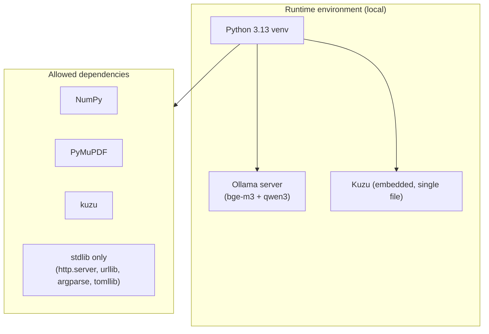

# 2. Architecture Constraints

> arc42 §2 — Constraints the architecture must respect (technical, organizational, conventions).
> **Status: draft.**

## 2.1 Technical Constraints

| # | Constraint | Background / consequence |
|---|---|---|
| TC1 | **Local inference only (Ollama)** | No cloud LLM/embedding APIs, no API keys. All embeddings + chat go through a local Ollama HTTP server (`http://localhost:11434`). Enables Q1 (privacy). |
| TC2 | **Python 3.10–3.13; 3.13 in practice** | Kuzu has **no Windows wheel for 3.14**, so the graph layer pins the project to ≤3.13. Code targets 3.10+ (`from __future__ import annotations`, `X | Y` types via the import). |
| TC3 | **Windows-primary** | Primary dev/runtime is Windows 11 + a `.venv`. Paths, stdout UTF-8 reconfiguration, and the pipx installer target Windows first; cross-platform is an aim, not yet CI-verified. |
| TC4 | **Minimal dependencies** | Runtime deps are essentially **NumPy, PyMuPDF, Kuzu** (+ pytest for dev). Everything else is Python stdlib (`http.server`, `urllib`, `html.parser`, `argparse`, `tomllib`, `json`). |
| TC5 | **Heavy deps isolated behind boundaries** | `fitz` (PyMuPDF) lives only in `pdf_parser.py`; `kuzu` only in `graph/builder.py` + `graph/store.py`. Non-PDF, non-graph use paths import neither (lazy imports). |
| TC6 | **UTF-8 everywhere** | Sample corpora are German (non-ASCII); all file I/O is UTF-8 with `ensure_ascii=False`; `cli.main()` reconfigures stdout/stderr to UTF-8 for Windows code pages. |
| TC7 | **No build step for the web UI** | The SPA is hand-written vanilla JS + a vendored `marked.min.js`; served by a stdlib `http.server`. No Node/bundler toolchain. |
| TC8 | **Embedded, file-based persistence** | Kuzu stores the graph as a single file (+ `.wal`); the index is `embeddings.npy` + `index.json`; the wiki is Markdown + `wiki.json`. No external database server. |

## 2.2 Organizational & Convention Constraints

| # | Constraint | Consequence |
|---|---|---|
| OC1 | **IR boundary** | Everything downstream of ingestion depends only on `openwiki/models.py` (the IR), never on a parser's internals. New parsers slot in behind `sources.parse_source`. |
| OC2 | **Backends behind protocols** | Embedding + chat backends implement the `Embedder` / `ChatModel` protocols; the agent/search never depend on Ollama directly. |
| OC3 | **Capabilities as subcommands** | New features are added as new CLI subcommands, not as more flags on existing ones. |
| OC4 | **Offline, deterministic tests** | Tests never hit the network; Ollama/Kuzu are faked or `pytest.importorskip`-gated; pure logic (ranking, decay, community detection) is unit-tested with plain values. |
| OC5 | **Additive graph layers** | Optional graph layers (entities, communities, reinforcement) use always-created (possibly empty) tables so store code degrades gracefully without them. |
| OC6 | **The index is the source of truth** | The Kuzu graph is a *mirror* (embeddings copied in); the NumPy `SemanticIndex` remains authoritative. |
| OC7 | **Local commit → user pushes** | Work is committed locally; pushing/tagging is an explicit user action. Version policy: features = minor bump, fixes/polish = patch. |

## 2.3 Constraints summary diagram

---
TODO (completion steps): add a licensing constraint note (arc42 CC-BY-SA; dependency
licenses); confirm the minimum supported Python; note any RAM/VRAM assumptions for the
default Ollama models.
