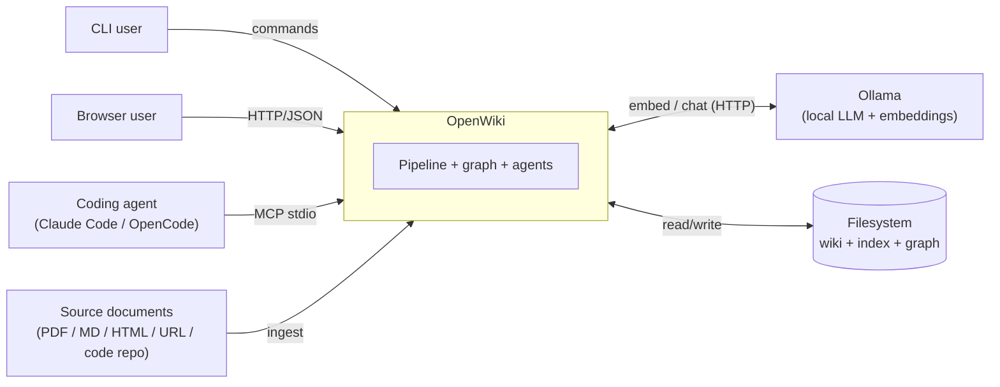

# 3. Context and Scope

> arc42 §3 — OpenWiki's boundary: who/what it talks to (business context) and over which
> technical interfaces. **Status: draft.**

## 3.1 Business Context

OpenWiki sits between **content sources** and three kinds of **consumers** (a human at a
CLI, a human in a browser, and an AI coding agent), with a **local Ollama** server providing
all model inference.

| Neighbor | Direction | What crosses the boundary |
|---|---|---|
| **CLI user** | in | Commands (`build`, `ask`, `serve`, `communities`, `decay`, `eval`, …) |
| **Browser user** | in/out | HTTP requests → JSON + static SPA (browse, search, chat/edit, graph, eval) |
| **Coding agent** | in/out | MCP JSON-RPC (stdio): `wiki_ask`, `wiki_global`, `wiki_search`, graph tools |
| **Source documents** | in | PDF, Markdown/text, HTML file, `http(s)` URL, or a code-repo directory |
| **Ollama** | in/out | Embedding requests (`/api/embed`) and chat requests (`/api/chat`) |
| **Filesystem** | in/out | Project layout: `sources/`, `output/wiki`, `output/index`, `output/graph`, `openwiki.toml` |

## 3.2 Technical Context

| Interface | Protocol / format | Module | Notes |
|---|---|---|---|
| **CLI** | `argparse` subcommands, stdout/stderr | `openwiki/cli.py` | Project-aware (flags > manifest > global config > defaults) |
| **Web API** | HTTP/1.1 + JSON over `http.server` | `openwiki/web/server.py` | Localhost by default; **no auth** |
| **Web UI** | Static HTML/CSS/JS SPA | `openwiki/web/static/` | No-build vanilla JS; client-side Markdown |
| **MCP** | JSON-RPC 2.0 over stdio (newline-delimited) | `openwiki/mcp_server.py` | Read-only tools; dependency-free |
| **Ollama — embeddings** | HTTP POST `/api/embed` (JSON) | `openwiki/embeddings.py` | `OllamaEmbedder`; default `bge-m3` |
| **Ollama — chat** | HTTP POST `/api/chat` (JSON) | `openwiki/llm.py` | `OllamaChat`; default `qwen3:30b-a3b-instruct-2507-q4_K_M`; supports tool calls |
| **Persistence** | Files: `.json`, `.md`, `.npy`, Kuzu DB | `models`, `wiki`, `search`, `graph/*` | See [Deployment](07-deployment-view.md) |

### Scope boundaries (what OpenWiki is *not*)

- Not a hosted or multi-tenant service — it runs on one machine for one user.
- Not a general-purpose vector database — brute-force cosine over a small corpus; Kuzu's
  vector index is a mirror for traversal, not the primary retrieval store.
- Not an authentication/authorization system — `serve` and MCP assume a trusted local host.

---
TODO (completion steps): expand the technical-context table with request/response payload
shapes per endpoint (or link to a generated API reference); add a sequence-style note for
the MCP `initialize`/`tools/list`/`tools/call` handshake.
