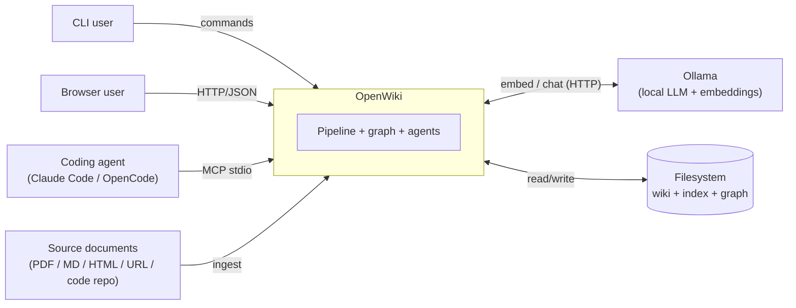

# 3. Context and Scope

> arc42 §3 — OpenWiki's boundary: who/what it talks to (business context) and over which
> technical interfaces, with concrete request/response shapes. **Status: complete.**

## 3.1 Business Context

OpenWiki sits between **content sources** and three kinds of **consumers** (a human at a
CLI, a human in a browser, and an AI coding agent), with a **local Ollama** server providing
all model inference.

| Neighbor | Direction | What crosses the boundary |
|---|---|---|
| **CLI user** | in | Commands (`build`, `ask`, `serve`, `communities`, `decay`, `eval`, `remember`/`recall`, …) |
| **Browser user** | in/out | HTTP requests → JSON + static SPA (browse, search, chat/edit, graph, eval) |
| **Coding agent** | in/out | MCP JSON-RPC (stdio): `wiki_ask`, `wiki_global`, `wiki_search`, graph tools |
| **Source documents** | in | PDF, Markdown/text, HTML file, `http(s)` URL, or a code-repo directory |
| **Session transcripts** | in | A conversation transcript (`type = "session"` source) captured into the memory tier — Path B, Second Brain mode (§8.15) |
| **Ollama** | in/out | Embedding requests (`/api/embed`) and chat requests (`/api/chat`) |
| **Filesystem** | in/out | Project layout: `sources/`, `output/wiki`, `output/index`, `output/graph`, `openwiki.toml` |

## 3.2 Technical Context

### 3.2.1 Interface overview

| Interface | Protocol / format | Module | Notes |
|---|---|---|---|
| **CLI** | `argparse` subcommands, stdout/stderr | `openwiki/cli.py` | Project-aware (flags > manifest > global config > defaults) |
| **Web API** | HTTP/1.1 + JSON over `http.server` | `openwiki/web/server.py` | Localhost by default; **no auth** |
| **Web UI** | Static HTML/CSS/JS SPA | `openwiki/web/static/` | No-build vanilla JS; client-side Markdown |
| **MCP** | JSON-RPC 2.0 over stdio (newline-delimited) | `openwiki/mcp_server.py` | Read-only tools; dependency-free |
| **Ollama — embeddings** | HTTP POST `/api/embed` (JSON) | `openwiki/embeddings.py` | `OllamaEmbedder`; default `bge-m3` |
| **Ollama — chat** | HTTP POST `/api/chat` (JSON) | `openwiki/llm.py` | `OllamaChat`; default `qwen3:30b-…`; supports tool calls |
| **Persistence** | Files: `.json`, `.md`, `.npy`, Kuzu DB | `models`, `wiki`, `search`, `graph/*` | See §7 |

### 3.2.2 Web API (`WikiWebApp`)

All responses are JSON (`Content-Type: application/json`, served `no-cache`). Error
convention: a `RuntimeError` (service not configured) → **503**; a missing resource → **404**;
an empty required field → **400**; any other exception → **500**; the body is `{"error": "…"}`.

| Method · Path | Request | Success response (200) |
|---|---|---|
| `GET /` · `/static/*` | — | `index.html` / static asset |
| `GET /api/wiki` | — | `{title, pages:[{slug, title, parent, children}]}` |
| `GET /api/pages/{slug}` | — | `{slug, markdown}` — **404** if unknown |
| `GET /api/project` | — | `{project:{name, root, sources, stages, settings, ontology, index, graph, communities}|null, registry:[…]}` |
| `GET /api/communities` | — | `{communities:[{id, label, summary, size}]}` |
| `GET /api/graph/{slug}` | — | `{root, nodes:[{id, kind, label, community?, …}], edges:[{source, target, type, score?}]}` — **404**/**503** |
| `GET /api/eval-sets` | — | `{sets:[…], default:"eval.jsonl"}` |
| `GET /api/eval?top_k=&expand_k=&eval_set=` | query params | `{exists, eval_set, count, top_k, expand_k, budget, reports:[…]}` |
| `GET /api/health` | — | `{graph:bool, …}` (connectivity, singletons, hubs) |
| `GET /api/answer-eval` | — | async-job status `{status, …}` |
| `POST /api/search` | `{query, k?}` | `{results:[{score, slug, title, pdf_page_start, pdf_page_end, text}]}` |
| `POST /api/chat` | `{message}` | `{reply, tool_calls:[{name, arguments, result}]}` — **400** if empty |
| `POST /api/compare` | `{question, top_k?, expand_k?, answers?}` | `{question, top_k, expand_k, answers, graph_available, answers_available, rag:{answer, cited, sources:[…]}, graphrag:{…}|null}` |
| `POST /api/global` | `{question}` | `{question, answer, cited:[…], communities:[{marker, label, size}]}` — **503** if no communities/chat |
| `POST /api/answer-eval` | `{top_k?, expand_k?, judge?, limit?, eval_set?}` | starts the background job → status |
| `POST /api/graph/expand` | `{type, id}` | `{nodes, edges}` — **400**/**404** |

### 3.2.3 MCP interface (`MCPStdioServer`)

Newline-delimited JSON-RPC 2.0 over **stdio** (the coding agent spawns `owiki mcp`). Handshake:

| Method | Request → Response |
|---|---|
| `initialize` | `{protocolVersion}` → `{protocolVersion, capabilities:{tools:{}}, serverInfo:{name, version}}` |
| `notifications/initialized` | notification → *(no reply)* |
| `tools/list` | → `{tools:[{name, description, inputSchema}]}` — advertised **by availability** (index/graph/entities/communities present) |
| `tools/call` | `{name, arguments}` → `{content:[{type:"text", text}], isError}` (tool errors are content, not transport errors) |
| `ping` | → `{}` |

Tools (read-only): `wiki_ask`, `wiki_global`, `wiki_search`, `wiki_read_page`,
`wiki_list_pages`, `wiki_graph_neighbors`, `wiki_find_path`, `wiki_find_entity`.

### 3.2.4 Ollama interface

| Purpose | Request | Response |
|---|---|---|
| **Embeddings** | `POST {host}/api/embed` · `{model, input:[texts]}` (batched) | `{embeddings:[[float, …], …]}` |
| **Chat** | `POST {host}/api/chat` · `{model, messages:[{role, content}], stream:false, options:{temperature, …}, tools?}` | `{message:{role, content, tool_calls?}}` |

Both via stdlib `urllib`, no API key; a `URLError`/`HTTPError` becomes a `RuntimeError` with a
"is Ollama running / model pulled?" hint (§6.8).

## 3.3 Scope boundaries (what OpenWiki is *not*)

- **Not a hosted or multi-tenant service** — one machine, one user; no auth (§11 R1).
- **Not a general-purpose vector database** — brute-force cosine over a small corpus; Kuzu's
  vector index is a mirror for traversal, not the primary retrieval store (ADR-3).
- **Not an authentication/authorization system** — `serve` and MCP assume a trusted local host.
- **Not a document editor** — it edits *derived* wiki pages, not the original sources.

---
*Chapter complete. Payload shapes verified against `web/server.py`, `mcp_server.py`,
`embeddings.py`, `llm.py`. Cross-refs: interfaces used at runtime → §6; error handling → §6.8/§8.*
