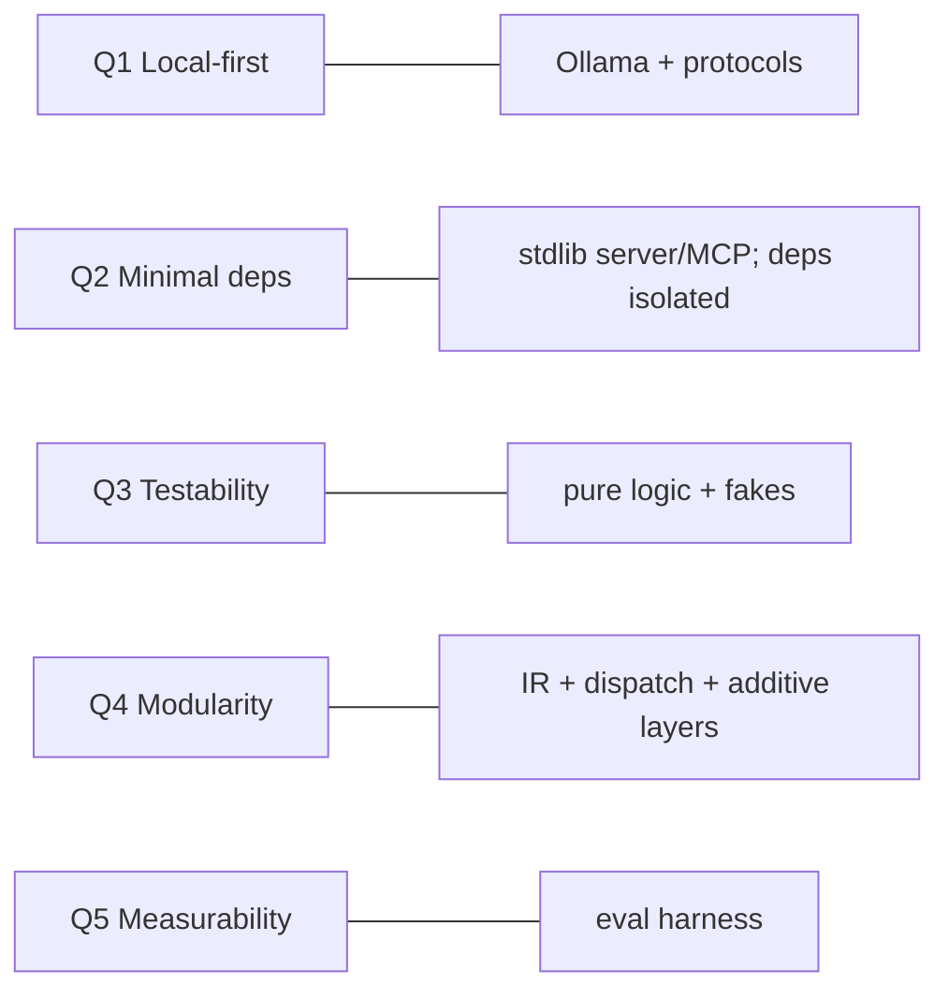

# 4. Solution Strategy

> arc42 §4 — The fundamental decisions and approaches that shape the architecture, and how
> they serve the quality goals. **Status: complete.**

A short summary; each strategy's full reasoning (context, alternatives, consequences) is the
ADR referenced in the last column — see [Architecture Decisions](09-architecture-decisions.md).

| Strategy | What it means | Serves | ADR |
|---|---|---|---|
| **IR-centric staged pipeline** | A single intermediate representation (`ParsedDocument` in `models.py`) sits between ingestion and everything downstream. Each stage is a pure-ish transform reading the previous stage's artifact. | Q4, Q3 | ADR-1 |
| **Local-first via Ollama + protocols** | All inference runs on a local Ollama; access is behind the `Embedder`/`ChatModel` protocols so backends are swappable and the corpus never leaves the machine. | Q1, Q4 | ADR-2 |
| **Stdlib-leaning, deps isolated** | Web server, MCP server, and 3 of 4 source parsers are stdlib-only; PyMuPDF and Kuzu are confined to single modules and imported lazily. | Q2 | ADR-4, ADR-5 |
| **Additive knowledge graph (a mirror)** | The Kuzu graph is layered *over* the wiki + index without mutating them; embeddings are mirrored in so traversal + vector search share one query. The index stays authoritative. | Q4 | ADR-3 |
| **Deep semantic graph layer** | Over the structural graph, an opt-in LLM layer: typed entities (deterministic-normalized), typed `Entity→Entity` **relations** (traversed by GraphRAG), and corpus-wide **entity resolution** (canonical + aliases + descriptions). | Q4, Q5 | ADR-12/22/23 |
| **Optional layers as empty-by-default tables** | Entities, relations, communities, and reinforcement edges are always-created (possibly empty) tables, so all store/agent code works with or without them. | Q4 | ADR-7 |
| **Reader-XOR-writer concurrency via a journal** | Kuzu is reader-XOR-writer, so `serve`/`chat` open **read-only by default** (concurrent readers); all writes (reinforce, remember, edit re-sync) queue to a lock-free write-ahead journal a writer folds in. `--sync` is exclusive-writable. | correctness, Q2 | ADR-8/17/19 |
| **Coexisting document + remembered tiers (Path B)** | In Second Brain mode the graph adds an *authoritative* remembered tier — sessions → reified `Assertion`s, newer facts superseding older — preserved across document rebuilds. Wiki Mode = memory off. | Q4 | ADR-14/15/16/18 |
| **Borrow GraphRAG ideas, not the library** | Community detection + summaries + global search reimplemented natively/locally. | Q2, Q5 | ADR-6 |
| **Project manifest + settings precedence** | `openwiki.toml` groups a KB; unset settings resolve `flag > manifest > ~/.openwiki config > built-in default`. | usability | ADR-10 |
| **Incremental, fingerprinted builds** | Per-stage input+param fingerprints skip unchanged stages; each stage records duration + token spend. | performance | ADR-11, ADR-20 |
| **Evaluation-driven design** | A backend-agnostic eval harness turns "is the graph / this retrieval add-on worth it?" into measured findings (RAG vs GraphRAG vs Hybrid vs Rerank vs Global) — add-ons are scored *before* they're trusted. | Q5 | ADR-9, ADR-21 |
| **World-model analysis (measure the structure)** | A read-only, additive `analysis/` toolkit (`owiki analyze`) measures the *structure* of the knowledge — graph↔semantic **coupling** (+ a 2-D map), **gaps**, fingerprint **compare**, and memory-tier **dynamics**. Analysis is to structure what eval is to retrieval; pure-NumPy core, heavier bits behind `[analysis]`. | Q5, Q4 | ADR-25 |
| **Capability-complete no-build UI** | The browser SPA surfaces *every* major backend capability (Ask with retrieval controls, the Analyse toolkit, the Begriffe entity browser, provenance filtering) and **streams** answers over SSE — holding the stdlib-server, no-build, zero-JS-dependency line. | usability, Q2 | ADR-26 |
| **Always-on observability** | A bounded, in-process metrics collector captures the latency + token counts Ollama returns (per call, per request, per build stage) — surfaced in the CLI, the System tab, and Projekt. | Q5, performance | ADR-20 |
| **Ship it: `owiki` build + Docker + CI** | Installable/containerizable, with CI running the offline suite (Linux, 3.11–3.13) + Docker build on every push; public publishing is license-gated. | Q2, usability | ADR-24 |
| **Grounded agents** | RAG/editing agents answer only from provided excerpts and cite provenance; the graph adds context, never ungrounded claims. | correctness, trust | §8.4 |

## 4.1 How the strategy maps to the top quality goals



## 4.2 Architecture at a glance

```
source ──parse_source──▶ ParsedDocument (IR) ──▶ JSON / Markdown
                               │
                        WikiBuilder ──▶ Wiki ──▶ output/wiki/
                               │
                   chunk_wiki + Embedder ──▶ SemanticIndex ──▶ output/index/
                               │
                RAGAgent + ChatModel ──▶ cited answer   (RAG / GraphRAG / hybrid / rerank)
                               │
              WikiAgent + WikiTools ⇄ ChatModel ──▶ edits pages/*.md
                               │
                    GraphBuilder ──▶ Kuzu graph ──▶ GraphStore
                               │  (+ entities/typed relations/resolution, communities, REINFORCES)
       capture_session + GraphStore.remember ──▶ remembered tier   (Path B, Second Brain)
                               │     (Session/Assertion + SUPERSEDES; recall)
                    WikiWebApp (http.server) ──▶ browser SPA (10 tabs; Ask streams via SSE)
                    MCPStdioServer ──▶ coding agents
   (every LLM/embed call → metrics.COLLECTOR: latency + tokens, observability)
   analysis/ (owiki analyze) ──▶ world-model coupling / gaps / compare / memory dynamics (read-only)
```

---
*Chapter complete. Each strategy row links to its ADR in §9 (full context/alternatives/
consequences there); the strategy→quality-goal mapping refines the goals from §1.2.*
