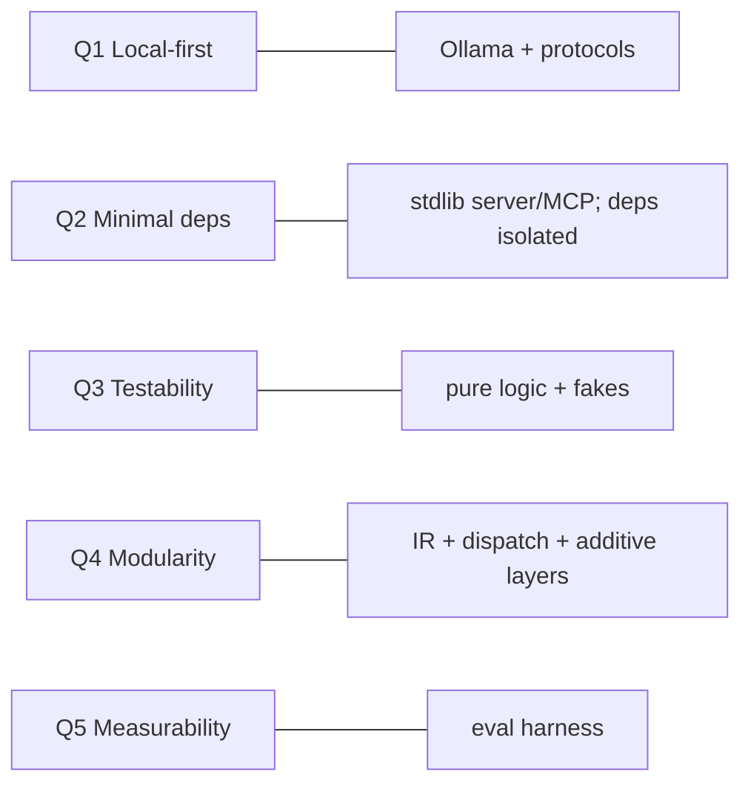

# 4. Solution Strategy

> arc42 §4 — The fundamental decisions and approaches that shape the architecture, and how
> they serve the quality goals. **Status: draft.**

A short summary; the reasoning is recorded as [Architecture Decisions](09-architecture-decisions.md).

| Strategy | What it means | Serves |
|---|---|---|
| **IR-centric staged pipeline** | A single intermediate representation (`ParsedDocument` in `models.py`) sits between ingestion and everything downstream. Each stage is a pure-ish transform reading the previous stage's artifact. | Q4 modularity, Q3 testability |
| **Local-first via Ollama + protocols** | All inference runs on a local Ollama; access is behind the `Embedder`/`ChatModel` protocols so backends are swappable and the corpus never leaves the machine. | Q1 privacy, Q4 extensibility |
| **Stdlib-leaning, deps isolated** | Web server, MCP server, and 3 of 4 source parsers are stdlib-only; PyMuPDF and Kuzu are confined to single modules and imported lazily. | Q2 minimal deps |
| **Additive knowledge graph (a mirror)** | The Kuzu graph is layered *over* the wiki + index without mutating them; embeddings are mirrored in so traversal + vector search share one query. The index stays authoritative. | Q4, avoids lock-in |
| **Optional layers as empty-by-default tables** | Entities, communities, and reinforcement edges are always-created (possibly empty) tables, so all store/agent code works with or without them. | Q4, robustness |
| **Project manifest + settings precedence** | `openwiki.toml` groups a KB; unset settings resolve `flag > manifest > ~/.openwiki config > built-in default`. | usability, reproducibility |
| **Evaluation-driven design** | A backend-agnostic eval harness (pure metrics + injected retrievers/chat) turns "is the graph worth it?" into measured findings (RAG vs GraphRAG vs Global). | Q5 measurability |
| **Grounded agents** | RAG/editing agents answer only from provided excerpts and cite provenance (page slugs / PDF pages); the graph adds context, never ungrounded claims. | correctness, trust |

## 4.1 How the strategy maps to the top quality goals



## 4.2 Architecture at a glance

```
source ──parse_source──▶ ParsedDocument (IR) ──▶ JSON / Markdown
                               │
                        WikiBuilder ──▶ Wiki ──▶ output/wiki/
                               │
                   chunk_wiki + Embedder ──▶ SemanticIndex ──▶ output/index/
                               │
                RAGAgent + ChatModel ──▶ cited answer      (RAG / GraphRAG)
                               │
              WikiAgent + WikiTools ⇄ ChatModel ──▶ edits pages/*.md
                               │
                    GraphBuilder ──▶ Kuzu graph ──▶ GraphStore
                               │     (+ communities, + REINFORCES memory)
                    WikiWebApp (http.server) ──▶ browser SPA
                    MCPStdioServer ──▶ coding agents
```

---
TODO (completion steps): add a short rationale paragraph per strategy row; explicitly link
each strategy to the ADR that records it once §9 is complete.
