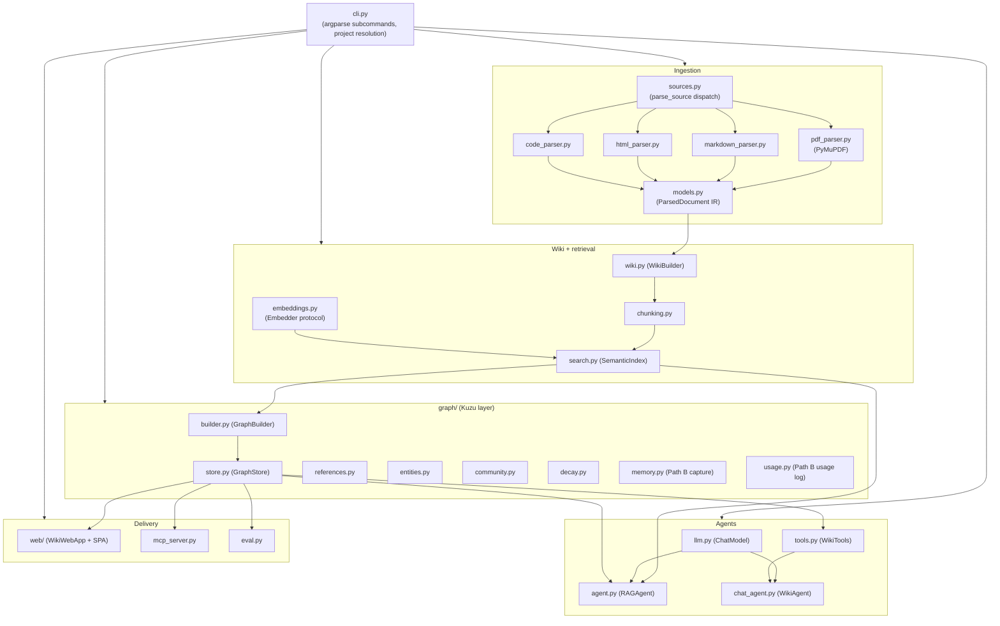
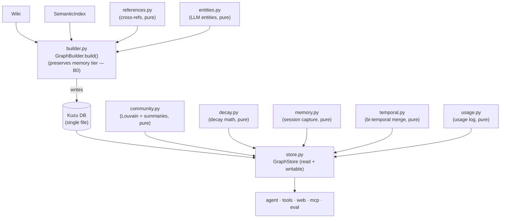
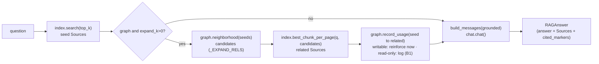

# 5. Building Block View

> arc42 §5 — The static decomposition into building blocks (modules/packages), top-down:
> Level 1 (overall system) → Level 2 (`graph/`, `web/`) → Level 3 (`GraphStore`, `RAGAgent`).
> **Status: complete.** `CLAUDE.md` remains the exhaustive per-module reference; this chapter
> is the structural view with the interfaces that matter at each boundary.

## 5.1 Whitebox — Overall System (Level 1)

### Decomposition rationale

The system is decomposed along **data-flow stages** (ingest → wiki → index → retrieve →
graph → deliver), and the decomposition is held stable by three boundaries:

- **The IR** (`models.ParsedDocument`) — every parser produces it; every downstream stage
  consumes only it. (ADR-1)
- **Backend protocols** (`Embedder`, `ChatModel`) — retrieval/agents depend on the protocol,
  not on Ollama. (ADR-2)
- **Additive graph layers** — optional tables (entities, communities, reinforcement) that
  store/agent code treats as best-effort. (ADR-7)

Only two modules touch heavy native deps: `pdf_parser.py` imports **`fitz`** (PyMuPDF);
`graph/builder.py` + `graph/store.py` import **`kuzu`**. Everything else is stdlib + NumPy,
which is what makes most of the system unit-testable offline (ADR / §8.9).

### Level-1 diagram

### Contained building blocks

`kind` = **pure** (stdlib/NumPy only, unit-testable without native deps) or **I/O** (touches
files, network/Ollama, or Kuzu).

**Ingestion**

| Block | kind | Responsibility & key interface |
|---|---|---|
| `models.py` | pure | The IR. `ParsedDocument` = `DocumentMetadata` + `OutlineItem[]` + `Page[]`. `to_dict()` / `from_dict()` / `to_markdown()`. |
| `sources.py` | I/O (lazy) | Dispatch: `parse_source(src, …) -> ParsedDocument`; `source_type`, `is_url`, `is_supported`, `source_exists`, `source_stem`, `SUPPORTED_SUFFIXES`. |
| `pdf_parser.py` | I/O (fitz) | `PDFParser.parse(path, max_pages) -> ParsedDocument`. **Only `fitz` importer.** |
| `markdown_parser.py` · `html_parser.py` · `code_parser.py` | pure | `*.parse()` → IR (headings/pages), stdlib only (`html.parser`, `os.walk`, urllib for URLs). |
| `merge.py` | pure | `combine_documents(docs, names) -> ParsedDocument` (multi-source corpus). |

**Wiki + retrieval**

| Block | kind | Responsibility & key interface |
|---|---|---|
| `wiki.py` | pure | `WikiBuilder(split_level).build(doc) -> Wiki`; `write_wiki(wiki, out_dir)`; `Wiki`/`WikiPage`, `slugify`. |
| `chunking.py` | pure | `chunk_wiki(wiki, size_words, overlap_words) -> list[Chunk]`; `chunk_text`, `normalize_text`. |
| `embeddings.py` | I/O (Ollama) | `Embedder` protocol (`embed_documents`, `embed_query`, `name`) + `OllamaEmbedder`; `get_embedder`. |
| `search.py` | I/O (Ollama via embedder) | `SemanticIndex.build/save/load`; `search(query, k) -> [SearchResult]`; `best_chunk_per_page(query, slugs)`; `search_hybrid(query, k)` (BM25+dense via RRF, ADR-21). Normalized NumPy matrix, brute-force cosine. |
| `lexical.py` | pure (+NumPy) | `tokenize`; `BM25` (inverted index) over chunk texts; `reciprocal_rank_fusion(rankings)`. The lexical half of hybrid retrieval (ADR-21) — no `rank-bm25` dependency. |
| `rerank.py` | pure (injected chat) | `rerank_order(query, texts, chat) -> permutation` (one chat call; `parse_order` robust) — the LLM re-rank pass (ADR-21). |
| `metrics.py` | pure (stdlib) | `MetricsCollector` + module `COLLECTOR` (bounded ring buffer) + `parse_ollama_stats`. Observability (ADR-20): LLM/embed/http events with latency + tokens. |

**Agents**

| Block | kind | Responsibility & key interface |
|---|---|---|
| `llm.py` | I/O (Ollama) | `ChatModel` protocol (`chat`, `chat_raw`, `name`) + `OllamaChat` (`/api/chat`, tool calls); `chat_stream` yields token deltas (Ollama `stream=true`) for the web Ask mode (ADR-26); pure `parse_stream_line`. Records per-call telemetry to `metrics.COLLECTOR` + `last_stats` (ADR-20). |
| `agent.py` | I/O (via injected deps) | `RAGAgent(index, chat, top_k, graph, expand_k, rerank, hybrid)`; `retrieve(q) -> [Source]`; `answer(q) -> RAGAnswer`; `stream(q)` yields (`sources`, then `delta`s, then `done`) for SSE streaming (ADR-26). RAG + GraphRAG (expands along typed **relations** too, ADR-22) + memory reinforcement; optional **hybrid** seed + LLM **re-rank** (ADR-21). |
| `tools.py` | I/O (files/graph) | `WikiTools`: `read_page`, `list_pages`, `search_wiki`, `edit_page`, `append_section`, `create_page`, `graph_neighbors`, `find_path`, `find_entity`, `schemas()`, `dispatch(name, args)`. |
| `chat_agent.py` | I/O (via tools/chat) | `WikiAgent(chat, tools).send(msg) -> AgentTurn`; `summarize_wiki(dir)`. Multi-turn tool loop. |

**Graph layer** (`graph/` — see §5.2)

**Delivery & support**

| Block | kind | Responsibility & key interface |
|---|---|---|
| `web/server.py` | I/O (http, Kuzu) | `WikiWebApp` (state + methods) + `make_handler(app)` + `serve(app, host, port)`. See §5.3. |
| `mcp_server.py` | I/O (stdio) | `build_server(wiki_dir, index, graph, agent) -> MCPStdioServer`; `.handle(msg)` is pure. |
| `eval.py` | pure (drivers inject I/O) | Metrics (`reciprocal_rank`, `hit_at_k`, `recall_at_k`, `grounding`, `community_grounding`, `judge_pairwise`, `task_success`) + drivers (`evaluate`, `make_retrievers`, `hybrid_pages`, `make_reranker`/`reranking_retriever` (ADR-21), `run_answer_eval`, `run_global_eval`, `run_cross_session_eval`). |
| `analysis/` | pure (+NumPy; graph read-only) | **World-model analysis** (ADR-25, Direction I), the structural analog of `eval.py`. `coupling.py` (`analyze_coupling`, `page_vectors` — graph↔semantic edge-cosine-vs-null, neighbor overlap, community coherence, the *graph-reach* headline); `projection.py` (`project_2d` — PCA, or UMAP via the `[analysis]` extra); `gaps.py` (`analyze_gaps` — missing-ref / near-duplicate / isolated-page / entity-merge candidates); `compare.py` (`flatten_fingerprint`/`diff_fingerprints`/`notable_differences`); `memory.py` (`analyze_memory` — Path B revision / consolidation / temperature / breadth / growth). Read-only, offline where possible; the `[analysis]` extra (scikit-learn) enriches, never required. |
| `project.py` | I/O (files) | `Project.load/find/resolve`; `out_dir`/`wiki_dir`/`index_dir`/`graph_path`; `setting(section, key)`; `render_manifest`. |
| `pipeline.py` | pure | `compute_fingerprints`, `stale_stages`, `BuildState` (incremental build state). |
| `userconfig.py` | I/O (files) | `UserConfig` + `Registry` under `~/.openwiki/`. |
| `cli.py` | I/O | argparse subcommands; wires stages; `_apply_project` settings precedence; `_DISPATCH`. |

### Key interfaces (the boundaries)

| Interface | Signature (essence) | Purpose |
|---|---|---|
| **IR** | `ParsedDocument.from_dict/to_dict/to_markdown` | Decouple parsers from downstream. |
| **Embedder** | `embed_documents(texts)->ndarray`, `embed_query(text)->ndarray` | Swap embedding backend. |
| **ChatModel** | `chat(messages)->str`, `chat_raw(messages, tools)->msg` | Swap chat backend; tool calling. |
| **GraphStore query API** | `neighborhood`, `explore`, `hybrid_search`, `find_path`, `communities`, … | The graph's read surface used by agent/UI/MCP/eval. |
| **WikiTools** | `dispatch(name, args)->str` + `schemas()` | The agent's action surface (advertised by availability). |
| **Web API / MCP** | HTTP+JSON / JSON-RPC over stdio | External delivery (see §3). |

## 5.2 Level 2 — the `graph/` subpackage

An additive Kuzu layer over the wiki + index. Only `builder`/`store` import `kuzu`;
`references`, `entities`, `community`, `decay`, `memory`, `usage` are **pure**
(unit-testable without a DB).

| Block | kind | Key interface | Notes |
|---|---|---|---|
| `builder.py` | I/O (kuzu) | `GraphBuilder(db_path, similar_k).build(wiki, index, references, entities, relations) -> stats` | Clean rebuild of the *derived* tier; mirrors embeddings into `Chunk`; creates all tables (some empty), incl. `RELATED_TO` (ADR-22) + `Entity.description/aliases` (ADR-23). **Snapshots + restores the remembered tier** across a rebuild (B0, ADR-16). |
| `store.py` | I/O (kuzu) | see §5.4 | Read-only by default; writable for edits/memory. |
| `references.py` | pure | `extract_references(doc, wiki, labels)`, `extract_references_multi(doc, wiki, meta, labels)`, `detect_page_offset(doc)` | Page + section/chapter cross-refs → `REFERENCES` edges; with `labels` each edge carries its citation phrases (linked inline, ADR-28). |
| `entities.py` | pure (injected chat/embedder) | `extract_entities(…) -> [Entity]`; `extract_relations(wiki, entities, chat) -> [Relation]` (typed `RELATED_TO`, ADR-22); `resolve_entities(entities, embedder, chat) -> canonical + aliases + descriptions` (ADR-23); `coerce_types`; `DEFAULT_ENTITY_TYPES` | LLM per page + deterministic normalization; relations + resolution opt-in. |
| `community.py` | pure (injected chat) | `detect_communities(edges, nodes)`; `summarize_community(chat, members)`; `summarize_facts(chat, facts)` (B5 memory themes); `answer_global(chat, q, communities)`; `parse_summary` | Consolidation layer / global search (docs **and**, via B5, memory). |
| `decay.py` | pure | `effective_weight(w, last_seen, now, half_life)`; `reinforced_weight(w, boost, cap)` | Usage-memory math. |
| `memory.py` | pure (injected chat) | `capture_session(chat, transcript, session_date) -> [MemoryFact]` (+ stated `valid_from`, `cardinality`); `parse_facts`; `format_memory(recalled)`; `assemble_context`; `facts_coexist(chat, older, newer)` (the veto-only coexistence check, ADR-27) | Path B: session → subject–predicate–object facts + context formatting. |
| `temporal.py` | pure | `plan_merge(records, okey, valid_from, cardinality, correct, coexists)` (the valid-time merge rule); `status`/`valid_at`/`believed_at`; `derive_legacy_intervals`; `parse_date`/`session_date`/`format_interval` | Path B+ (B7, ADR-27): the bi-temporal model — decides how a fact slots into its history. |
| `usage.py` | pure | `usage_log_path(db)`; `append_usage(path, pairs)`; `read_usage`; `clear_usage` | Path B (B1): the append-only read-path usage-log sidecar. |
| `journal.py` | pure | `journal_path(db)`; `append_remember`/`append_reindex`; `read_journal`/`clear_journal` | Path B (B1, ADR-19): the lock-free write-ahead journal (queued `remember`/`reindex` ops). |

## 5.3 Level 2 — the `web/` subpackage

`web/server.py` holds application state + logic (`WikiWebApp`); a thin
`ThreadingHTTPServer` handler (`make_handler`) maps HTTP routes to `WikiWebApp` methods and
serves static files; `web/static/` is a no-build vanilla-JS SPA.

| Block | kind | Key interface |
|---|---|---|
| `WikiWebApp` | I/O (Kuzu/Ollama/files) | `manifest` (+ per-page `source`/`book` provenance), `get_page`, `related` (the "Verwandte Seiten" overlay + the page's entities for auto-linking, ADR-28), `search` (+ `hybrid`), `chat` (+ per-turn stats), `ask`/`ask_stream` (RAG for the Ask mode — non-streaming + SSE, ADR-26), `entities`/`entity` (Begriffe browser), `graph_explore`/`graph_expand`/`graph_neighborhood`, `project_info`, `communities`, `ask_global`, `run_eval`, `compare`, `health_stats`, `start_answer_eval`/`answer_eval_status`, `metrics` (ADR-20), `memory_info`/`memory_recall`/`memory_context` (Path B; `as_of`/`known_at`, ADR-27)/`memory_timeline` (B7), `analyze`/`analyze_gaps`/`analyze_memory` (ADR-25). Serves a **10-tab, no-build SPA** (Projekt · Wiki · Graph · **Begriffe** · **Analyse** · Gedächtnis · Evaluation · System · Tutorial · Hilfe) with an **Ask** chat mode, dark theme, collapsible panels, and token-streaming answers (ADR-26). |
| `make_handler(app)` / `serve(app, host, port)` | I/O (http) | JSON API + static file serving on `ThreadingHTTPServer`. |
| `web/static/{index.html, app.js, style.css, marked.min.js}` | — | SPA: 10 tabs (see `WikiWebApp`); client-side Markdown with the related-pages panel + entity auto-links (ADR-28); the Gedächtnis time view (as-of / known-at pickers, timeline); hand-rolled force-directed graph explorer. |

Concurrency: the threaded server shares **one** `GraphStore` connection, guarded by the
store's `RLock` (§8.6).

## 5.4 Level 3 — `GraphStore` (whitebox)

The graph's read/write surface. Opened read-only by default; writable (exclusive Kuzu lock)
for edits + memory. Responsibilities group as:

| Group | Methods |
|---|---|
| **Stats / health** | `stats()`, `health(hub_limit)`, `has_entities()`, `has_communities()` |
| **Neighborhood / paths** | `neighborhood(slug, similar_k)`, `find_path(a, b, max_hops)` |
| **Explorer (UI)** | `explore(slug)`, `expand(type, id)`, `expand_page`, `expand_entity` |
| **Entities** | `entities_for_page(slug)`, `pages_for_entity(query)` |
| **Communities** | `communities()`, `community_members()`, `page_graph()`, `page_snippet()`, `upsert_communities(assignment, summaries, labels)` |
| **Usage-memory** | `reinforce(from, to, now, boost)`, `decay(now, half_life, floor)`, `record_usage(pairs)` (writable → reinforce / read-only → log), `fold_usage(now)`, `pending_usage()` |
| **Remembered tier (Path B)** | `remember(session_id, facts, embedder, now, session_date, correct, coexist)` (merge by **valid time** via `temporal.plan_merge` — reaffirm / extend / add, close or retract rivals, ADR-27), `recall(query, embedder, k, include_superseded, as_of, known_at)` (valid now ∧ believed by default), `timeline(query)`, `list_assertions()`/`memory_overview()`, `has_memory()`, `forget_all()`; one schema-tolerant `_load_assertions` + `_view` serve every reader, and `_migrate_temporal` upgrades older graphs in place |
| **Memory consolidation (Path B / B5)** | `assertion_graph(similar_k)` (similarity over current facts), `upsert_memory_concepts(assignment, summaries, labels)` (the "sleep" pass → `MemoryConcept` themes), `memory_concepts()`, `has_memory_concepts()` |
| **Context assembly (Path B / B6)** | `relevant_concepts(assertion_ids, limit)` (attractor themes for the activated facts), `context_for(query, embedder, identity, k, max_themes, max_chars, as_of)` (the three-tier assembly → one context string with each fact's validity, read-only + fail-soft) |
| **Incremental update** | `upsert_page(slug, text, …, embedder)` (MERGE page, replace chunks, recompute `SIMILAR_TO`) |
| **Hybrid retrieval** | `hybrid_search(vector, k)` (vector k-NN → owning page) |

`neighborhood()` returns a typed node/edge set including a `reinforced` group ranked by
time-decayed weight (§8, ADR-8). Optional-layer queries are best-effort (try/except → empty)
so the store works on graphs built before a layer existed.

## 5.5 Level 3 — `RAGAgent` (whitebox)

The retrieval→answer pipeline (`answer(question)` = `retrieve` + one chat call):

- `_EXPAND_RELS = (references, referenced_by, similar, shared_entity, reinforced)` — the
  edge kinds GraphRAG expands along.
- Grounding is enforced by the system prompt; `Source` carries provenance so `[n]` citations
  resolve to pages. `record_usage` reinforces immediately on a writable graph (a `--sync` writer) or
  appends to the usage log on the read-only default (`serve`/`chat`/`ask`/MCP) for a writer to fold in
  (B1, ADR-17/ADR-19) — best-effort, never blocking retrieval.

---
*Chapter complete. Cross-refs: interfaces → §8 (concepts), decisions → §9, runtime flows →
§6. Path B **landed** its blocks: `graph/memory.py` + `graph/usage.py` (§5.2), the remembered-tier
+ usage-log methods on `GraphStore` (§5.4), and read-path `record_usage` in `RAGAgent` (§5.5) —
authoritative graph (B0/ADR-16), read-path reinforcement (B1/ADR-17), contradiction versioning (B4/ADR-18),
refined into bi-temporal validity by `graph/temporal.py` (B7/ADR-27).*
