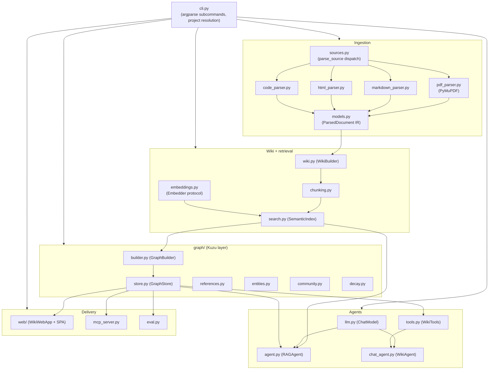

# 5. Building Block View

> arc42 §5 — The static decomposition into building blocks (modules/packages), top-down.
> **Status: draft.** For exhaustive per-module detail see `CLAUDE.md`; this chapter gives the
> structural view.

## 5.1 Whitebox — Overall System (Level 1)

OpenWiki is a single Python package `openwiki/` with a small web subpackage and a graph
subpackage. Data flows left-to-right through the pipeline; the CLI wires stages together.

## 5.2 Key building blocks (responsibilities)

| Building block | Responsibility | Depends on |
|---|---|---|
| `models.py` | The **IR**: `ParsedDocument` = metadata + outline + pages (text/tables/images); JSON + Markdown serialization | — (the boundary) |
| `sources.py` | Dispatch a source to the right parser (`parse_source`); type/URL helpers | the parsers |
| `pdf_parser.py` | PDF → IR via **PyMuPDF** (the only `fitz` importer) | `models` + fitz |
| `markdown_parser.py` / `html_parser.py` / `code_parser.py` | MD/text, HTML/URL, code-repo → IR (stdlib only) | `models` |
| `wiki.py` | `WikiBuilder` splits the IR along the outline into linked pages; `write_wiki` | `models` |
| `chunking.py` | Cut page text into overlapping word-window chunks with provenance | `models`/`wiki` |
| `embeddings.py` | `Embedder` protocol + `OllamaEmbedder` (`/api/embed`) | urllib |
| `search.py` | `SemanticIndex`: normalized NumPy matrix + brute-force cosine; save/load; `best_chunk_per_page` | numpy, `embeddings` |
| `llm.py` | `ChatModel` protocol + `OllamaChat` (`/api/chat`, tool calls) | urllib |
| `agent.py` | `RAGAgent`: retrieve → grounded prompt → cited `RAGAnswer`; GraphRAG expansion + memory reinforcement | `search`, `llm`, `GraphStore` |
| `tools.py` | `WikiTools`: read/edit/create page tools (slug-safe); graph + entity tools; graph sync on write | `wiki`, `search`, `GraphStore` |
| `chat_agent.py` | `WikiAgent`: multi-turn tool loop with history | `llm`, `tools` |
| `graph/builder.py` | `GraphBuilder`: build the Kuzu graph (nodes/edges + HNSW, mirrored embeddings) | kuzu, `wiki`, `search` |
| `graph/store.py` | `GraphStore`: neighborhood, find_path, hybrid_search, explore/expand, entities, communities, **reinforce/decay**, incremental upsert | kuzu |
| `graph/references.py` | Extract page/section cross-references (no kuzu) | `models`/`wiki` |
| `graph/entities.py` | LLM entity extraction + normalization (no kuzu) | `llm` |
| `graph/community.py` | Louvain community detection + LLM summaries + `answer_global` (no kuzu) | `llm` |
| `graph/decay.py` | Pure exponential decay + capped reinforcement math (no kuzu) | — |
| `web/server.py` | `WikiWebApp` + `ThreadingHTTPServer` JSON API + static SPA | stdlib, all of the above |
| `mcp_server.py` | Dependency-free stdio MCP server exposing read-only `wiki_*` tools | `tools`, `agent` |
| `eval.py` | Pure ranking/grounding metrics + injected retriever/answer/global drivers | `agent` (lazy) |
| `project.py` | `Project` (manifest discovery/layout/settings) | tomllib |
| `pipeline.py` | Build-stage fingerprint chain + `.openwiki/state.json` (incremental builds) | — |
| `userconfig.py` | `~/.openwiki/` config + project registry | tomllib |
| `merge.py` | Merge multiple `ParsedDocument`s into one corpus | `models` |
| `cli.py` | argparse CLI; wires stages; project/settings resolution; dispatch | everything |

## 5.3 Level 2 — the `graph/` subpackage

Only `builder` and `store` import `kuzu`; `references`, `entities`, `community`, and `decay`
are pure (stdlib/numpy) so they are unit-testable without a database. Optional layers
(`Entity`/`MENTIONS`, `Community`/`IN_COMMUNITY`, `REINFORCES`) are always-created tables,
empty until their producer runs.

## 5.4 Level 2 — the `web/` subpackage

`web/server.py` holds `WikiWebApp` (state + methods) and a thin `ThreadingHTTPServer`
handler; `web/static/` is a no-build SPA (`index.html`, `app.js`, `style.css`, vendored
`marked.min.js`) with six tabs (Projekt / Wiki / Graph / Evaluation / Tutorial / Hilfe).

---
TODO (completion steps): add a Level-2 diagram for `graph/` and `web/`; per key block, add a
short interface signature (the 2–3 methods callers actually use); mark which blocks are
"pure" vs "I/O".
