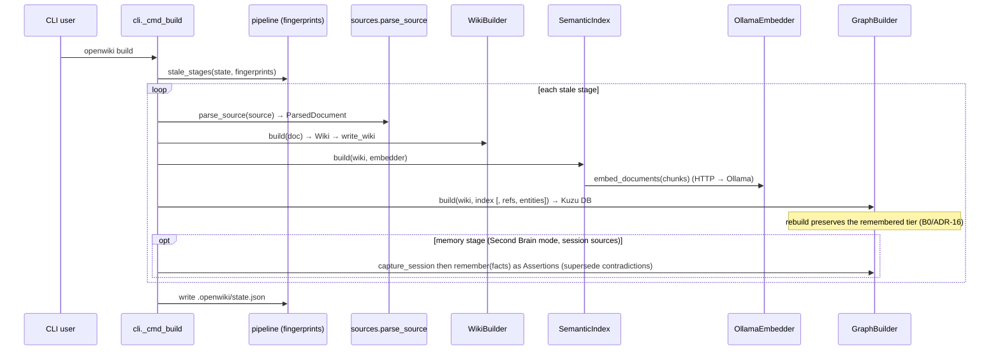
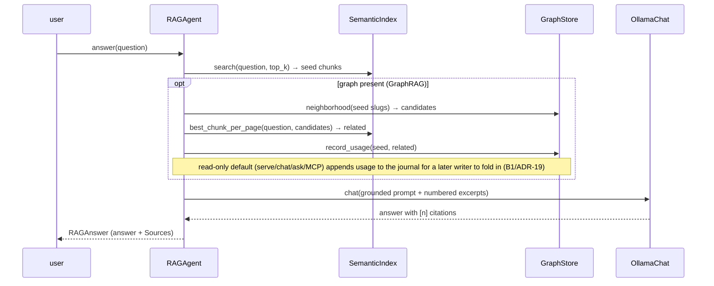
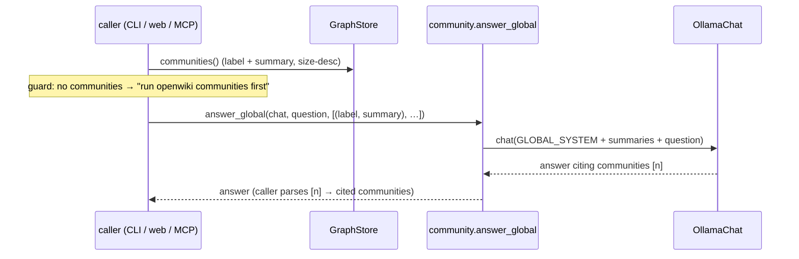
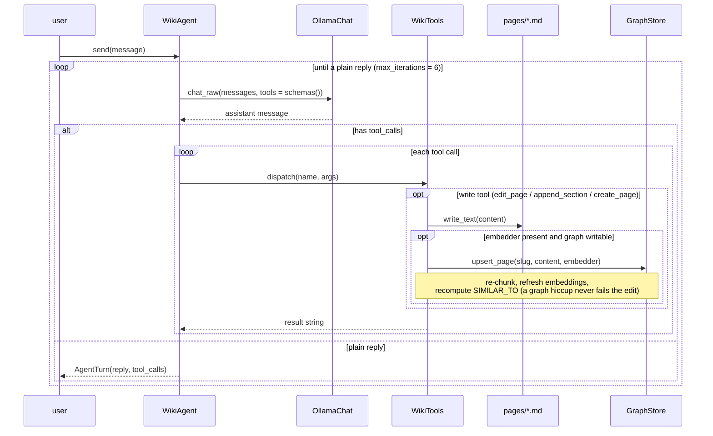
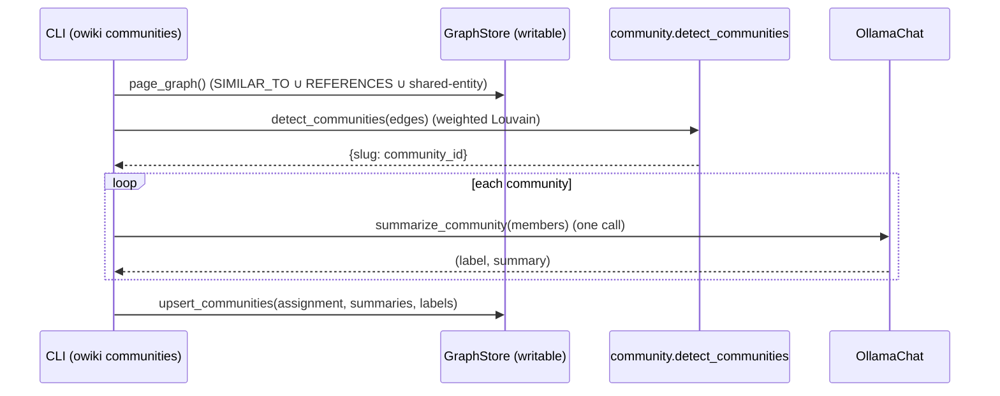
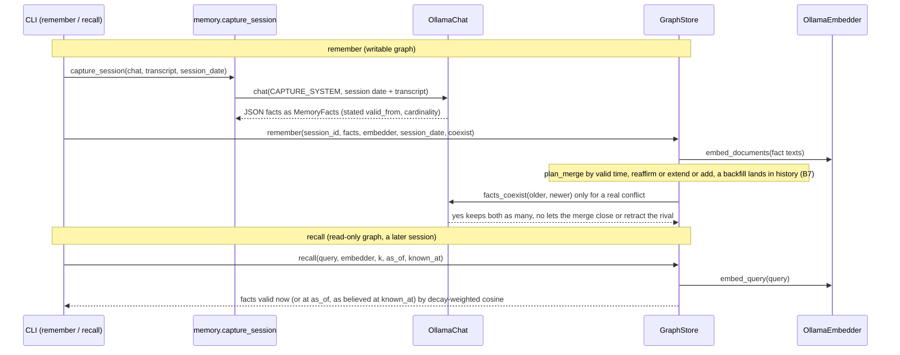

# 6. Runtime View

> arc42 §6 — How the building blocks collaborate at runtime, via the key scenarios, plus the
> cross-cutting runtime aspects (errors, fallback, concurrency). **Status: complete.**

Scenarios map to the use cases in §1 and the blocks in §5.

## 6.1 Scenario: Build a knowledge base (`openwiki build`)

Incremental — a per-stage fingerprint chain (`pipeline.py`) skips stages whose inputs+params
are unchanged; `--force` / `--only STAGES` override.

The pipeline stages are **ingest → wiki → index → graph → memory**; the `memory` stage runs only
when `[memory] enabled` and `type = "session"` sources are declared, and stands *off* the document
fingerprint chain (a doc rebuild preserves memory, so it needn't re-capture).

## 6.2 Scenario: Ask a grounded question (`ask`, RAG / GraphRAG)

The chat model is instructed to answer **only** from the excerpts; every excerpt carries
provenance (page slug, PDF pages), so `[n]` citations are traceable (`cited_markers()`).

## 6.3 Scenario: Ask a thematic question (`ask --global` / `wiki_global`)

Chunk-RAG can't answer whole-corpus questions; global search synthesizes over the community
summaries instead. Same flow behind the CLI, the web box, and the MCP tool.

## 6.4 Scenario: Chat + edit a page, with live graph sync (`chat` / `serve`)

`WikiAgent` runs a bounded tool loop; a successful write is reflected in the graph
incrementally when the graph is writable and an embedder is present.

`--dry-run` makes writes preview-only (no file write, no graph sync). Read-only tools
(`search_wiki`, `read_page`, `graph_neighbors`, `find_path`, `find_entity`) are advertised
only when their backing artifact (index / graph / entities) is present.

## 6.5 Scenario: Consolidate communities (`openwiki communities`)

The "sleep pass" — re-runnable over the built graph.

## 6.6 Scenario: Decay the usage-memory (`openwiki decay`)

No model calls — pure maintenance: open the graph writable and first **fold in** any pending
read-path usage (`fold_usage` → `reinforce` each logged pair, then clear the log — B1/ADR-17), then
read every `REINFORCES` edge, recompute its `effective_weight(weight, last_seen, now, half_life)`,
and **persist** the decayed weight (reset `last_seen = now`) or **delete** the edge if it fell below
the floor. Returns `{edges, decayed, pruned}` (plus the folded-in count).

## 6.7 Scenario: Remember & recall a session (Path B)

The remembered tier's write→read loop. `remember` captures a transcript into facts and merges them
**by valid time** (ADR-27): each fact slots into its subject+predicate history — re-affirm, extend back,
or add; a rival's interval is closed (a change) or the rival retracted (a correction), after a veto-only
"can both be true at once?" check. `recall` returns the facts most relevant to a query that are valid
**now** — or at an `as_of` date, or as believed at a `known_at` date. Both require Second Brain mode
(`[memory] enabled`, ADR-14).

A doc rebuild preserves these assertions — validity columns + `SUPERSEDES` provenance edges included
(B0/ADR-16) — so memory survives re-ingesting sources; a pre-B7 graph is migrated in place by the first
writable `remember` (no rebuild). The cross-session eval (`eval --cross-session`) measures whether this assembled
memory beats a cold start and a raw-log paste (`docs/path-b-memory.md` §7).

## 6.8 Cross-cutting runtime aspects

### Error / timeout handling (Ollama unreachable)
Any embed or chat call goes through `urllib` to Ollama; on failure `OllamaEmbedder` /
`OllamaChat` raise a `RuntimeError` with a clear hint. It surfaces per entry point:

| Entry point | Behaviour on Ollama failure |
|---|---|
| CLI (`ask`, `build`, `communities`, `eval …`) | Error printed to stderr; non-zero exit. |
| Web API | `RuntimeError` → HTTP **503** (`do_POST`/`do_GET` handler). |
| Editing agent | `WikiTools.dispatch` catches per-tool exceptions → an `ERROR: …` string the model can react to; the loop stays alive. |

Note: even plain RAG retrieval needs the embedder (to embed the *query*), so a down Ollama
fails retrieval, not just generation.

### Concurrency & the write-ahead journal (B1 / ADR-19)
Kuzu 0.11 is **reader-XOR-writer** (measured): a writable connection blocks all readers, and readers
block a writer — no simultaneous read+write. So `serve`/`chat` open the graph **read-only by default**,
which lets many readers (`ask`/MCP/`recall`/`context`, a second `serve`) run **concurrently** while
serving. Writes never take the lock on these paths: reinforcement **appends** to `graph.usage.jsonl`
(B1/ADR-17), and `remember` / host-`capture` / a chat-edit's graph re-sync **queue** to
`graph.journal.jsonl` as `remember`/`reindex` ops. A writer **folds** both (`fold_usage` +
`fold_journal`) at `serve`/`chat` start+shutdown (`_transient_fold`), in `openwiki decay`, or on the
next `remember`; writable opens use **retry-with-backoff** for transient contention. A chat-edit still
writes its page file live — only the *graph* re-sync is deferred. `--sync` opts `serve`/`chat` back into
a held-**writable** connection (live edit-sync + immediate reinforcement, exclusive lock — blocks other
graph access); if that writable open is refused, `_open_graph` falls back to read-only (a note is printed).

- The web layer is a `ThreadingHTTPServer`: requests run on separate threads that share **one**
  `GraphStore` connection, serialized by the store's re-entrant `RLock` (an `upsert` holds it
  across a batch).
- The stateful `WikiAgent` (mutable history) is serialized by a lock in `WikiWebApp`.
- Writable graph access is process-exclusive → at most one `--sync` (or `remember`/`decay`) writer at a
  time; the read-only default + journal is how concurrent access is achieved.

---
*Chapter complete. Cross-refs: block interfaces → §5; grounding/provenance, concurrency,
error handling as concepts → §8; the read-only-write trade-off → ADR-8 (§9).*
