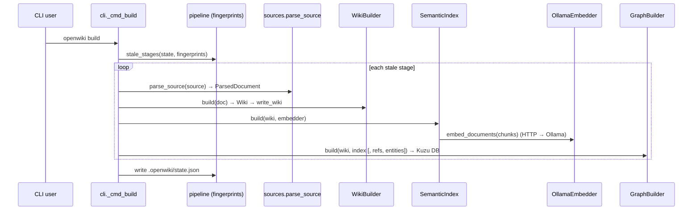
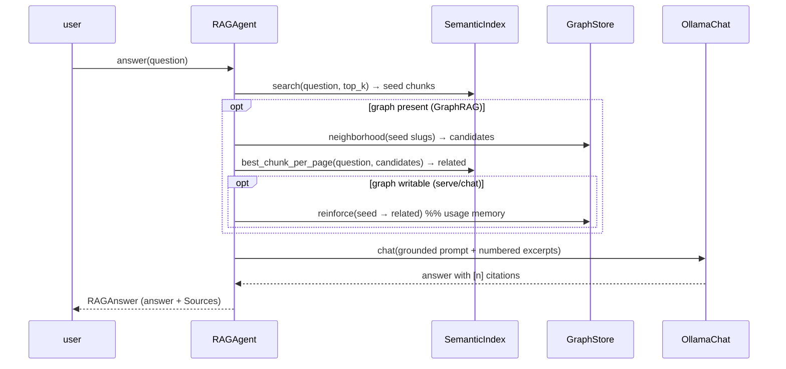

# 6. Runtime View

> arc42 §6 — How the building blocks collaborate at runtime, via a few key scenarios.
> **Status: draft** (scenarios sketched; sequence detail to be completed).

## 6.1 Scenario: Build a knowledge base (`openwiki build`)

Incremental: a per-stage fingerprint chain (`pipeline.py`) skips stages whose inputs+params
are unchanged.

## 6.2 Scenario: Ask a grounded question (`ask`, RAG / GraphRAG)

Key point: the chat model is instructed to answer **only** from the excerpts; every excerpt
carries provenance (page slug, PDF pages), so citations are traceable.

## 6.3 Scenario: Ask a thematic question (`ask --global` / `wiki_global`)

Chunk-RAG can't answer whole-corpus questions. Global search instead synthesizes over the
**community summaries**: `GraphStore.communities()` → `community.answer_global(chat, question,
summaries)` → an answer citing communities `[n]`. Requires `openwiki communities` to have run.

## 6.4 Scenario: Chat + edit a page (`chat` / `serve`)

`WikiAgent` runs a multi-turn tool loop: model → tool calls (`search_wiki`, `read_page`,
`edit_page`, …) → results → model. On a successful write, `WikiTools` writes `pages/*.md`
and, with a writable graph + embedder, calls `GraphStore.upsert_page` (re-chunk, refresh
embeddings, recompute `SIMILAR_TO`) so the graph stays in sync live.

## 6.5 Scenario: Consolidate + decay (maintenance)

- `openwiki communities`: read the page graph → Louvain → one LLM summary per community →
  write `Community` + `IN_COMMUNITY` (the "sleep pass").
- `openwiki decay`: age every `REINFORCES` edge to now (persist decayed weight) and prune
  those below the floor (forgetting).

---
TODO (completion steps): add sequence diagrams for §6.3–§6.5; add an error/timeout path
(Ollama unreachable) and the read-only-graph fallback; note threading (the web server shares
one RLock-guarded Kuzu connection).
