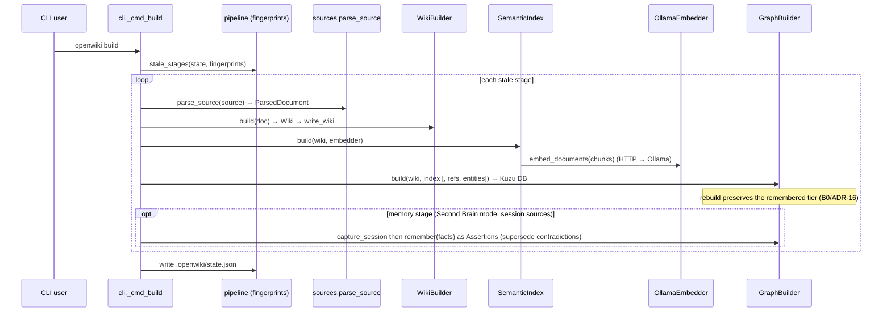
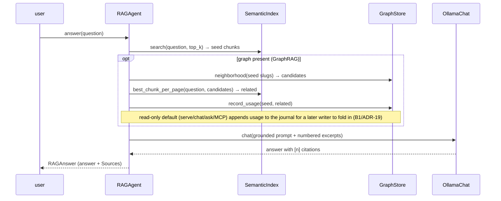
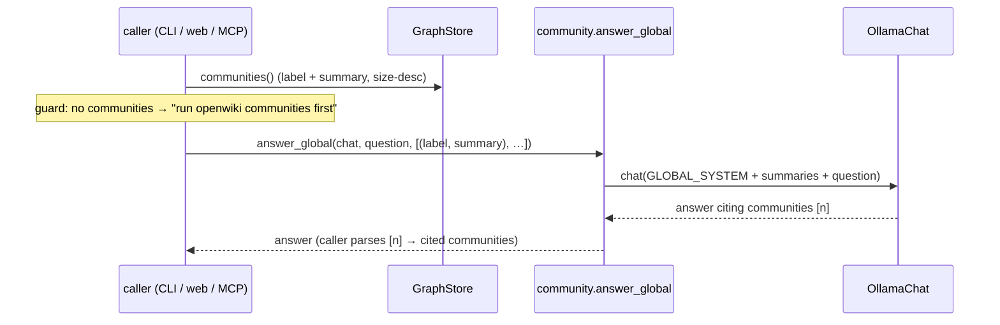
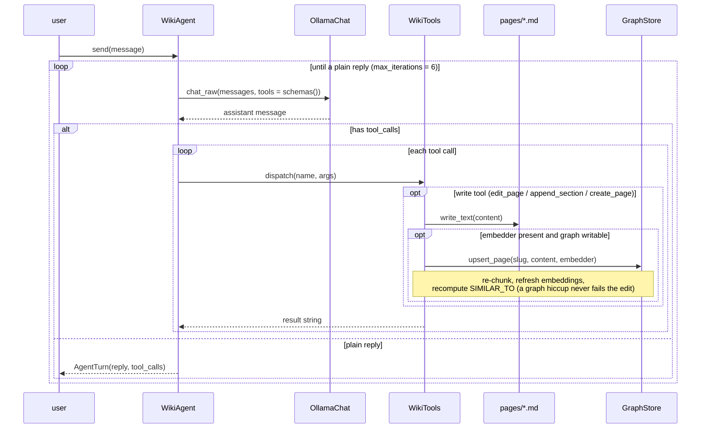
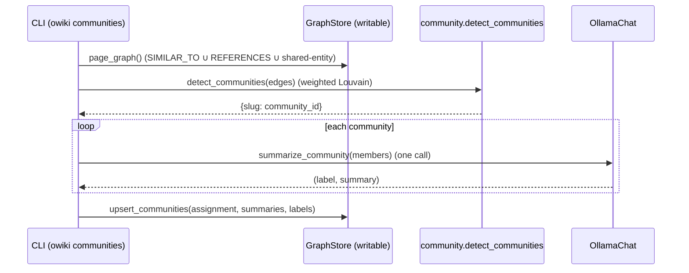
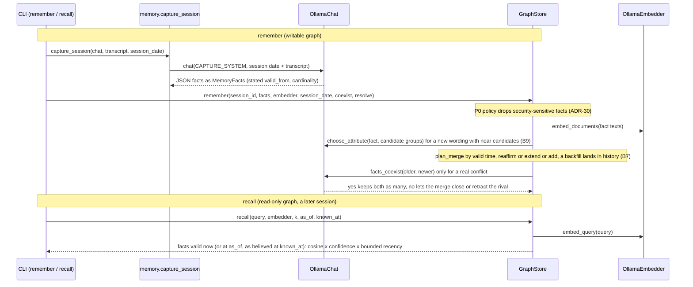
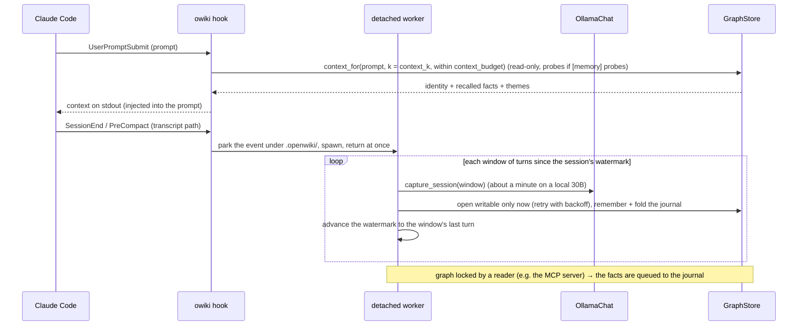
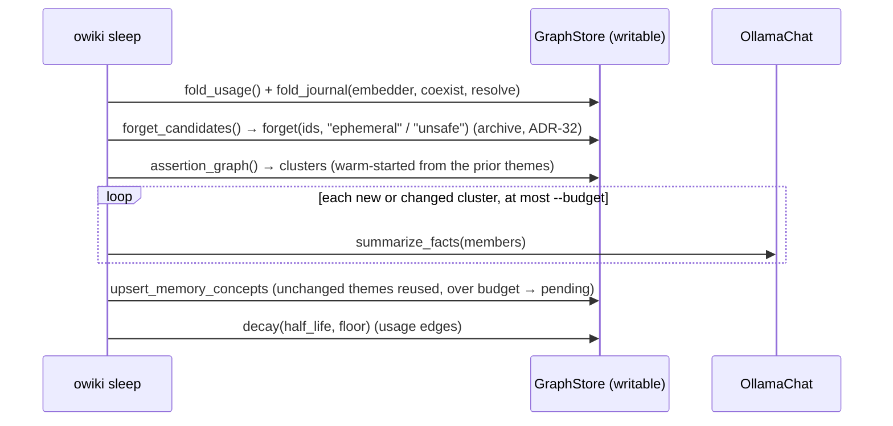
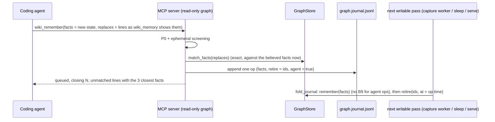
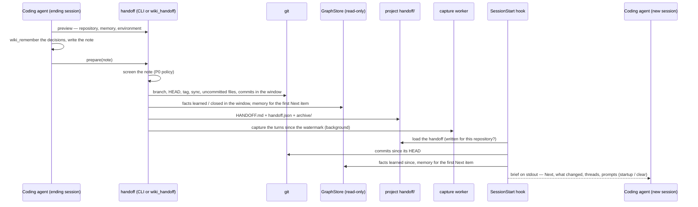

# 6. Runtime View

> arc42 §6 — How the building blocks collaborate at runtime, via the key scenarios, plus the
> cross-cutting runtime aspects (errors, fallback, concurrency). **Status: complete.**

Scenarios map to the use cases in §1 and the blocks in §5.

## 6.1 Scenario: Build a knowledge base (`openwiki build`)

Incremental — a per-stage fingerprint chain (`pipeline.py`) skips stages whose inputs+params
are unchanged; `--force` / `--only STAGES` override.

```mermaid
sequenceDiagram
  participant U as CLI user
  participant CLI as cli._cmd_build
  participant P as pipeline (fingerprints)
  participant S as sources.parse_source
  participant W as WikiBuilder
  participant IX as SemanticIndex
  participant E as OllamaEmbedder
  participant G as GraphBuilder

  U->>CLI: openwiki build
  CLI->>P: stale_stages(state, fingerprints)
  loop each stale stage
    CLI->>S: parse_source(source) → ParsedDocument
    CLI->>W: build(doc) → Wiki → write_wiki
    CLI->>IX: build(wiki, embedder)
    IX->>E: embed_documents(chunks)  (HTTP → Ollama)
    CLI->>G: build(wiki, index [, refs, entities]) → Kuzu DB
    Note over G: rebuild preserves the remembered tier (B0/ADR-16)
    opt memory stage (Second Brain mode, session sources)
      CLI->>G: capture_session then remember(facts) as Assertions (supersede contradictions)
    end
  end
  CLI->>P: write .openwiki/state.json
```

The pipeline stages are **ingest → wiki → index → graph → memory**; the `memory` stage runs only
when `[memory] enabled` and `type = "session"` sources are declared, and stands *off* the document
fingerprint chain (a doc rebuild preserves memory, so it needn't re-capture).

## 6.2 Scenario: Ask a grounded question (`ask`, RAG / GraphRAG)

```mermaid
sequenceDiagram
  participant U as user
  participant A as RAGAgent
  participant IX as SemanticIndex
  participant GS as GraphStore
  participant C as OllamaChat

  U->>A: answer(question)
  A->>IX: search(question, top_k) → seed chunks
  opt graph present (GraphRAG)
    A->>GS: neighborhood(seed slugs) → candidates
    A->>IX: best_chunk_per_page(question, candidates) → related
    A->>GS: record_usage(seed, related)
    Note over A,GS: read-only default (serve/chat/ask/MCP) appends usage to the journal for a later writer to fold in (B1/ADR-19)
  end
  A->>C: chat(grounded prompt + numbered excerpts)
  C-->>A: answer with [n] citations
  A-->>U: RAGAnswer (answer + Sources)
```

The chat model is instructed to answer **only** from the excerpts; every excerpt carries
provenance (page slug, PDF pages), so `[n]` citations are traceable (`cited_markers()`).

## 6.3 Scenario: Ask a thematic question (`ask --global` / `wiki_global`)

Chunk-RAG can't answer whole-corpus questions; global search synthesizes over the community
summaries instead. Same flow behind the CLI, the web box, and the MCP tool.

```mermaid
sequenceDiagram
  participant U as caller (CLI / web / MCP)
  participant GS as GraphStore
  participant CM as community.answer_global
  participant C as OllamaChat

  U->>GS: communities()  (label + summary, size-desc)
  Note over U: guard: no communities → "run openwiki communities first"
  U->>CM: answer_global(chat, question, [(label, summary), …])
  CM->>C: chat(GLOBAL_SYSTEM + summaries + question)
  C-->>CM: answer citing communities [n]
  CM-->>U: answer  (caller parses [n] → cited communities)
```

## 6.4 Scenario: Chat + edit a page, with live graph sync (`chat` / `serve`)

`WikiAgent` runs a bounded tool loop; a successful write is reflected in the graph
incrementally when the graph is writable and an embedder is present.

```mermaid
sequenceDiagram
  participant U as user
  participant WA as WikiAgent
  participant C as OllamaChat
  participant WT as WikiTools
  participant FS as pages/*.md
  participant GS as GraphStore

  U->>WA: send(message)
  loop until a plain reply (max_iterations = 6)
    WA->>C: chat_raw(messages, tools = schemas())
    C-->>WA: assistant message
    alt has tool_calls
      loop each tool call
        WA->>WT: dispatch(name, args)
        opt write tool (edit_page / append_section / create_page)
          WT->>FS: write_text(content)
          opt embedder present and graph writable
            WT->>GS: upsert_page(slug, content, embedder)
            Note over WT,GS: re-chunk, refresh embeddings,<br>recompute SIMILAR_TO (a graph hiccup never fails the edit)
          end
        end
        WT-->>WA: result string
      end
    else plain reply
      WA-->>U: AgentTurn(reply, tool_calls)
    end
  end
```

`--dry-run` makes writes preview-only (no file write, no graph sync). Read-only tools
(`search_wiki`, `read_page`, `graph_neighbors`, `find_path`, `find_entity`) are advertised
only when their backing artifact (index / graph / entities) is present.

## 6.5 Scenario: Consolidate communities (`openwiki communities`)

The "sleep pass" — re-runnable over the built graph.

```mermaid
sequenceDiagram
  participant U as CLI (owiki communities)
  participant GS as GraphStore (writable)
  participant CD as community.detect_communities
  participant C as OllamaChat

  U->>GS: page_graph()  (SIMILAR_TO ∪ REFERENCES ∪ shared-entity)
  U->>CD: detect_communities(edges)  (weighted Louvain)
  CD-->>U: {slug: community_id}
  loop each community
    U->>C: summarize_community(members)  (one call)
    C-->>U: (label, summary)
  end
  U->>GS: upsert_communities(assignment, summaries, labels)
```

## 6.6 Scenario: Decay the usage-memory (`openwiki decay`)

No model calls — pure maintenance: open the graph writable and first **fold in** any pending
read-path usage (`fold_usage` → `reinforce` each logged pair, then clear the log — B1/ADR-17), then
read every `REINFORCES` edge, recompute its `effective_weight(weight, last_seen, now, half_life)`,
and **persist** the decayed weight (reset `last_seen = now`) or **delete** the edge if it fell below
the floor. Returns `{edges, decayed, pruned}` (plus the folded-in count).

## 6.7 Scenario: Remember & recall a session (Path B)

The remembered tier's write→read loop. `remember` captures a transcript into facts and merges them
**by valid time** (ADR-27): each fact slots into its subject+predicate history — re-affirm, extend back,
or add; a rival's interval is closed (a change) or the rival retracted (a correction), after a veto-only
"can both be true at once?" check. `recall` returns the facts most relevant to a query that are valid
**now** — or at an `as_of` date, or as believed at a `known_at` date. Both require Second Brain mode
(`[memory] enabled`, ADR-14).

```mermaid
sequenceDiagram
  participant U as CLI (remember / recall)
  participant M as memory.capture_session
  participant C as OllamaChat
  participant GS as GraphStore
  participant E as OllamaEmbedder

  Note over U,GS: remember (writable graph)
  U->>M: capture_session(chat, transcript, session_date)
  M->>C: chat(CAPTURE_SYSTEM, session date + transcript)
  C-->>M: JSON facts as MemoryFacts (stated valid_from, cardinality)
  U->>GS: remember(session_id, facts, embedder, session_date, coexist, resolve)
  Note over GS: P0 policy drops security-sensitive facts (ADR-30)
  GS->>E: embed_documents(fact texts)
  GS->>C: choose_attribute(fact, candidate groups) for a new wording with near candidates (B9)
  Note over GS: plan_merge by valid time, reaffirm or extend or add, a backfill lands in history (B7)
  GS->>C: facts_coexist(older, newer) only for a real conflict
  C-->>GS: yes keeps both as many, no lets the merge close or retract the rival

  Note over U,GS: recall (read-only graph, a later session)
  U->>GS: recall(query, embedder, k, as_of, known_at)
  GS->>E: embed_query(query)
  GS-->>U: facts valid now (or at as_of, as believed at known_at): cosine x confidence x bounded recency
```

A doc rebuild preserves these assertions — validity columns + `SUPERSEDES` provenance edges included
(B0/ADR-16) — so memory survives re-ingesting sources; a pre-B7 graph is migrated in place by the first
writable `remember` (no rebuild). The cross-session eval (`eval --cross-session`) measures whether this assembled
memory beats a cold start and a raw-log paste (`docs/path-b-memory.md` §7).

## 6.8 Scenario: Memory flows with a coding agent (host hooks + backfill)

In Second Brain mode, `claude-code --hooks [--into DIR]` wires memory into Claude Code's lifecycle (bound to a
memory project, pinned to the installing interpreter). Every hook runs `owiki hook …`, reads the event JSON on
stdin and **always exits 0** — a failing hook must never block a prompt.

```mermaid
sequenceDiagram
  participant CC as Claude Code
  participant H as owiki hook
  participant W as detached worker
  participant C as OllamaChat
  participant GS as GraphStore

  CC->>H: UserPromptSubmit (prompt)
  H->>GS: context_for(prompt, k = context_k, within context_budget) (read-only, probes if [memory] probes)
  GS-->>H: identity + recalled facts + themes
  H-->>CC: context on stdout (injected into the prompt)
  CC->>H: SessionEnd / PreCompact (transcript path)
  H->>W: park the event under .openwiki/, spawn, return at once
  loop each window of turns since the session's watermark
    W->>C: capture_session(window) (about a minute on a local 30B)
    W->>GS: open writable only now (retry with backoff), remember + fold the journal
    W->>W: advance the watermark to the window's last turn
  end
  Note over W,GS: graph locked by a reader (e.g. the MCP server) → the facts are queued to the journal
```

Since v0.97 the worker captures **every turn since the session's watermark** (the last captured turn, kept in
`.openwiki/capture-state.json`), in per-day windows of at most 20,000 characters dated by their first turn; one
worker per session (a lock file), and turns that arrive while it runs are picked up before it exits. Before, each
capture read only the transcript's last 20,000 characters — about 13 % of a long session.

`owiki backfill <transcripts dir>` imports existing history the same way, offline: one dated session per UTC day,
cut into bounded windows valid from their first turn; resumable (days already remembered are skipped) and robust
(a failed window is logged and skipped).

## 6.9 Scenario: Nightly maintenance (`openwiki sleep`)

One writable, schedulable pass (Task Scheduler / cron); `--dry-run` lists what would be forgotten.

```mermaid
sequenceDiagram
  participant S as owiki sleep
  participant GS as GraphStore (writable)
  participant C as OllamaChat

  S->>GS: fold_usage() + fold_journal(embedder, coexist, resolve)
  S->>GS: forget_candidates() → forget(ids, "ephemeral" / "unsafe") (archive, ADR-32)
  S->>GS: assertion_graph() → clusters (warm-started from the prior themes)
  loop each new or changed cluster, at most --budget
    S->>C: summarize_facts(members)
  end
  S->>GS: upsert_memory_concepts (unchanged themes reused, over budget → pending)
  S->>GS: decay(half_life, floor) (usage edges)
```

Forgetting needs no model call (pure policy); consolidation is the only step that calls the chat model — an
unreachable model skips it without costing the other steps.

## 6.10 Scenario: The agent records a changed state (`wiki_remember`)

Stale state ("the web UI has six tabs") could not be inferred afterwards by the local model (§13.4–13.5 of the
design doc); the writer that makes the change records it (opt-in, `[memory] agent_writes`, ADR-33).

```mermaid
sequenceDiagram
  participant A as Coding agent
  participant M as MCP server (read-only graph)
  participant GS as GraphStore
  participant J as graph.journal.jsonl
  participant F as next writable pass (capture worker / sleep / serve)

  A->>M: wiki_remember(facts = new state, replaces = lines as wiki_memory shows them)
  M->>M: P0 + ephemeral screening
  M->>GS: match_facts(replaces) (exact, against the believed facts now)
  M->>J: append one op (facts, retire = ids, agent = true)
  M-->>A: queued, closing N, unmatched lines with the 3 closest facts
  F->>GS: fold_journal: remember(facts) (no B9 for agent ops), then retire(ids, at = op time)
```

## 6.11 Scenario: A session hands over to the next (`owiki handoff`, `SessionStart`)

Memory carries facts across sessions; the handoff carries the narrative — what was decided, what's half done, what
comes next — and the state at the moment of handing over (ADR-36). The agent writes a short note; OpenWiki derives
the rest, and derives it again at resume time, so the brief says what changed since.

```mermaid
sequenceDiagram
  participant A as Coding agent (ending session)
  participant O as handoff (CLI or wiki_handoff)
  participant G as git
  participant GS as GraphStore (read-only)
  participant P as project handoff/
  participant W as capture worker
  participant H as SessionStart hook
  participant N as Coding agent (new session)

  A->>O: preview — repository, memory, environment
  A->>A: wiki_remember the decisions, write the note
  A->>O: prepare(note)
  O->>O: screen the note (P0 policy)
  O->>G: branch, HEAD, tag, sync, uncommitted files, commits in the window
  O->>GS: facts learned / closed in the window, memory for the first Next item
  O->>P: HANDOFF.md + handoff.json + archive/
  O->>W: capture the turns since the watermark (background)
  H->>P: load the handoff (written for this repository?)
  H->>G: commits since its HEAD
  H->>GS: facts learned since, memory for the first Next item
  H-->>N: brief on stdout — Next, what changed, threads, prompts (startup / clear)
```

The window reaches back to the session start or the last handoff, whichever is later, and at most 7 days (sessions
can run for months). The hook brief is bounded (6,000 chars: header and Next always, then what changed, the note's
other sections, files and memory as room allows) and notes the session that resumed it, so a later session reads
"already resumed".

## 6.12 Cross-cutting runtime aspects

### Error / timeout handling (Ollama unreachable)
Any embed or chat call goes through `urllib` to Ollama; on failure `OllamaEmbedder` /
`OllamaChat` raise a `RuntimeError` with a clear hint. It surfaces per entry point:

| Entry point | Behaviour on Ollama failure |
|---|---|
| CLI (`ask`, `build`, `communities`, `eval …`) | Error printed to stderr; non-zero exit. |
| Web API | `RuntimeError` → HTTP **503** (`do_POST`/`do_GET` handler). |
| Editing agent | `WikiTools.dispatch` catches per-tool exceptions → an `ERROR: …` string the model can react to; the loop stays alive. |

Note: even plain RAG retrieval needs the embedder (to embed the *query*), so a down Ollama
fails retrieval, not just generation.

### Model-call grouping for bulk jobs (GPU memory)
On the reference 12 GB GPU the 30B chat model and the embedder don't fit together, so Ollama reloads a model
whenever an embedding call follows a chat call or vice versa (~19 s each). Interactive paths accept that; **bulk
jobs group their calls** instead. The LoCoMo runner (`locomo.run_locomo`) captures every pending session first
(chat), embeds all captured facts in one batch through a `CachingEmbedder`, merges them (chat checks, embeddings
served from the cache), embeds all pending questions in one batch, then answers and judges (chat) — measured ~26 s
→ ~1 s per question and ~58 s → ~33 s per session. Its state persists per conversation (graph, captured facts,
answers), so a `--time-budget` stop and a transient model-server error (one retry) cost no work.

### Concurrency & the write-ahead journal (B1 / ADR-19)
Kuzu 0.11 is **reader-XOR-writer** (measured): a writable connection blocks all readers, and readers
block a writer — no simultaneous read+write. So `serve`/`chat` open the graph **read-only by default**,
which lets many readers (`ask`/MCP/`recall`/`context`, a second `serve`) run **concurrently** while
serving. Writes never take the lock on these paths: reinforcement **appends** to `graph.usage.jsonl`
(B1/ADR-17), and `remember` / host-`capture` / a chat-edit's graph re-sync **queue** to
`graph.journal.jsonl` as `remember`/`reindex` ops. A writer **folds** both (`fold_usage` +
`fold_journal`) at `serve`/`chat` start+shutdown (`_transient_fold`), in `openwiki decay`, or on the
next `remember`; writable opens use **retry-with-backoff** for transient contention. A chat-edit still
writes its page file live — only the *graph* re-sync is deferred. `--sync` opts `serve`/`chat` back into
a held-**writable** connection (live edit-sync + immediate reinforcement, exclusive lock — blocks other
graph access); if that writable open is refused, `_open_graph` falls back to read-only (a note is printed).

**Since v0.100 (ADR-38)** the long-running readers — the MCP server, `serve`, `chat`, `ask` — hold the graph only per
call (`LazyGraph`), and memory writes run in two phases: plan on a read-only connection (`dry_run`, memoized model
checks, cached embeddings), then apply under the write lock from the cache. So a hook capture, a `sleep` or the fold
worker that `wiki_remember` spawns writes *during* a session, holding the lock for seconds (real queue: 276 s → 7.2 s);
the journal is the fallback when the graph stays locked.

- The web layer is a `ThreadingHTTPServer`: requests run on separate threads that share **one**
  `GraphStore` connection, serialized by the store's re-entrant `RLock` (an `upsert` holds it
  across a batch).
- The stateful `WikiAgent` (mutable history) is serialized by a lock in `WikiWebApp`.
- Writable graph access is process-exclusive → at most one `--sync` (or `remember`/`decay`) writer at a
  time; the read-only default + journal is how concurrent access is achieved.

---
*Chapter complete. Cross-refs: block interfaces → §5; grounding/provenance, concurrency,
error handling as concepts → §8; the read-only-write trade-off → ADR-8 (§9).*
