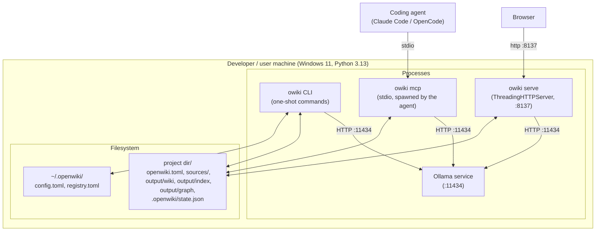

# 7. Deployment View

> arc42 §7 — The technical infrastructure and how software maps onto it.
> **Status: complete.**

OpenWiki is a **single-machine, single-user** deployment. There is no server tier, no
container orchestration, no external database — everything runs as local processes reading
and writing local files.

## 7.1 Installation & runtime

| Aspect | Detail |
|---|---|
| **Dev install** | `py -m venv .venv` → `pip install -e ".[dev]"` → the `openwiki` console script + pytest. |
| **Global install** | `pipx`-based (`install-openwiki.ps1`) exposes `openwiki` and the short alias `owiki` on PATH. |
| **Runtime prerequisite** | A running **Ollama** with the models pulled (`ollama pull bge-m3`; the chat model). |
| **Web server** | `owiki serve --port 8137` binds `127.0.0.1` by default; the SPA is served from `web/static/`. |
| **MCP server** | `owiki mcp` is **spawned by the coding agent** over stdio (config via `owiki claude-code` / `owiki opencode` scaffolders). |
| **State** | Per-project under `<project>/output` + `.openwiki/state.json`; user-global under `~/.openwiki/` (override `$OPENWIKI_HOME`). |
| **Docker** | `docker build -t owiki .` → the `owiki` CLI as entrypoint (`python:3.13-slim`; the sample PDF/tests never enter the image). Ollama stays **external** (`--host http://host.docker.internal:11434`); `docker-compose.yml` serves a mounted project. CI builds + smoke-tests the image (ADR-24). |
| **Distribution / PyPI** | Distribution name **`owiki`** (import package stays `openwiki`; `openwiki` is taken on PyPI). Builds clean (`python -m build` → sdist + wheel, `twine check`); a **manual** OIDC trusted-publishing workflow exists but publishing is **license-gated** — not yet on PyPI (ADR-24). |
| **CI** | GitHub Actions (`.github/workflows/ci.yml`) runs the offline test suite (Python 3.11–3.13) + the Docker build on every push/PR to `main` (ADR-24). |

## 7.2 Processes & lifecycle

- **CLI commands** are one-shot processes that open artifacts, do work, and exit.
- **`serve`** is long-running; since v0.57 it opens the graph **read-only by default** (ADR-19),
  so other processes (`ask`/MCP/`recall`, a second reader) run concurrently — agent edits write
  page files live and defer their graph re-sync to a lock-free journal a writer folds in (at
  start/shutdown). `--sync` restores an exclusive **writable** connection (live edit-sync, blocks
  other graph access). `owiki decay`/`remember` open writable transiently with retry-backoff.
- **`mcp`** opens the graph **read-only** (coding agents only read).
- **Ollama** is an independent local service shared by all of the above.

## 7.3 Platform notes

| Platform | Status | Notes |
|---|---|---|
| **Windows 11** | primary | `.venv\Scripts\python`; `install-openwiki.ps1` (pipx) provides `openwiki`/`owiki`. |
| **Linux** | **CI-verified** | The offline suite + Docker build run on `ubuntu-latest` (Python 3.11–3.13) on every push (ADR-24) — so cross-platform correctness is now proven, not just claimed. Use `.venv/bin/python`. |
| **macOS** | supported, unverified | Use `.venv/bin/python`; the editable install works. No macOS CI leg yet (§11 R6). |
| **Ollama** | any | Independent local service; the host is configurable (`--host` / manifest `models.host`) if it runs elsewhere on the LAN. |

Resource sizing follows §2 TC9 — the default 30B q4 chat model needs a capable machine;
configure smaller models (ADR-2) for constrained hosts.

## 7.4 Network exposure (and why it's localhost-only)

`serve` binds `127.0.0.1` by default (configurable via `--bind` / manifest `serve.bind`).
Because there is **no authentication or authorization** on either the web API (which includes
*write* paths: chat-driven edits) or the MCP server (§3.3, §11 R1), the current safe posture
is **localhost only**. Binding to `0.0.0.0` or reverse-proxying it exposes unauthenticated
read *and edit* access to anyone who can reach the port — do not do this without adding
authN/authZ first (tracked as §11 R1). The MCP server is stdio-only (no network surface) and
read-only, so it does not carry this risk.

---
*Chapter complete. Cross-refs: process behaviour → §6.8 (concurrency/fallback); the
no-auth exposure risk → §11 R1; resource assumptions → §2 TC9.*
