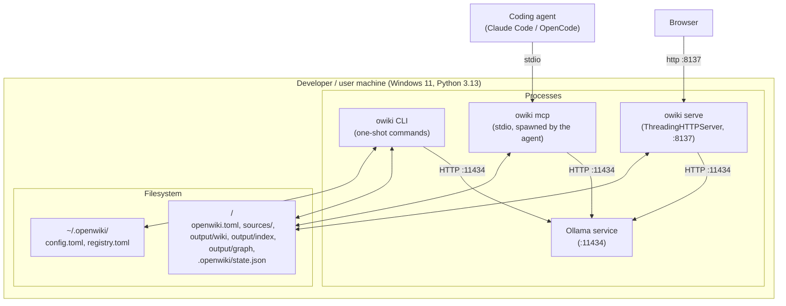

# 7. Deployment View

> arc42 §7 — The technical infrastructure and how software maps onto it.
> **Status: draft.**

OpenWiki is a **single-machine, single-user** deployment. There is no server tier, no
container orchestration, no external database — everything runs as local processes reading
and writing local files.

## 7.1 Installation & runtime

| Aspect | Detail |
|---|---|
| **Dev install** | `py -m venv .venv` → `pip install -e ".[dev]"` → the `openwiki` console script + pytest. |
| **Global install** | `pipx`-based (`install-openwiki.ps1`) exposes `openwiki` and the short alias `owiki` on PATH. |
| **Runtime prerequisite** | A running **Ollama** with the models pulled (`ollama pull bge-m3`; the chat model). |
| **Web server** | `owiki serve --port 8137` binds `127.0.0.1` by default; the SPA is served from `web/static/`. |
| **MCP server** | `owiki mcp` is **spawned by the coding agent** over stdio (config via `owiki claude-code` / `owiki opencode` scaffolders). |
| **State** | Per-project under `<project>/output` + `.openwiki/state.json`; user-global under `~/.openwiki/` (override `$OPENWIKI_HOME`). |

## 7.2 Processes & lifecycle

- **CLI commands** are one-shot processes that open artifacts, do work, and exit.
- **`serve`** is long-running; it opens the graph **writable** (exclusive Kuzu lock) when an
  index is present and not `--dry-run`, so agent edits update the graph live. Only one
  writable process at a time; a read-only fallback is used if the lock is held.
- **`mcp`** opens the graph **read-only** (coding agents only read).
- **Ollama** is an independent local service shared by all of the above.

---
TODO (completion steps): add a macOS/Linux deployment note (`.venv/bin/python`, no pipx
script yet); document ports/binding and how to expose beyond localhost (and why that needs
auth first — see §11); note resource sizing for the default models.
