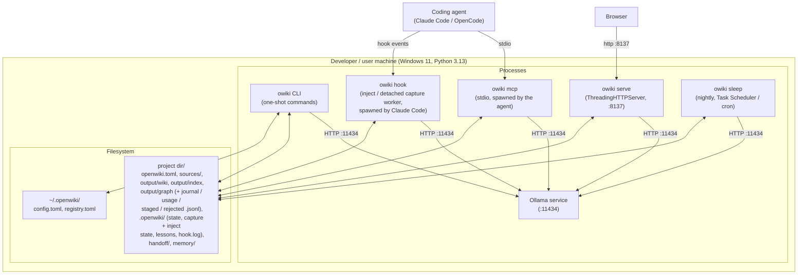

# 7. Deployment View

> arc42 §7 — The technical infrastructure and how software maps onto it.
> **Status: complete.**

OpenWiki is a **single-machine, single-user** deployment. There is no server tier, no
container orchestration, no external database — everything runs as local processes reading
and writing local files.

```mermaid
flowchart TB
  subgraph host["Developer / user machine (Windows 11, Python 3.13)"]
    subgraph procs["Processes"]
      cliP["owiki CLI\n(one-shot commands)"]
      serveP["owiki serve\n(ThreadingHTTPServer, :8137)"]
      mcpP["owiki mcp\n(stdio, spawned by the agent)"]
      hookP["owiki hook\n(inject / detached capture worker,\nspawned by Claude Code)"]
      sleepP["owiki sleep\n(nightly, Task Scheduler / cron)"]
      ollama["Ollama service\n(:11434)"]
    end
    subgraph disk["Filesystem"]
      proj["project dir/\n openwiki.toml, sources/,\n output/wiki, output/index,\n output/graph (+ journal / usage /\n staged / rejected .jsonl),\n .openwiki/ (state, capture + inject\n state, lessons, hook.log),\n handoff/, memory/"]
      home["~/.openwiki/\n config.toml, registry.toml"]
    end
  end
  browser["Browser"] -->|http :8137| serveP
  agentApp["Coding agent\n(Claude Code / OpenCode)"] -->|stdio| mcpP
  agentApp -->|hook events| hookP
  cliP & serveP & mcpP & hookP & sleepP -->|HTTP :11434| ollama
  cliP & serveP & mcpP & hookP & sleepP <--> proj
  cliP <--> home
```

## 7.1 Installation & runtime

| Aspect | Detail |
|---|---|
| **Dev install** | `py -m venv .venv` → `pip install -e ".[dev]"` → the `openwiki` console script + pytest. |
| **Optional extras** | `pip install -e ".[analysis]"` adds **scikit-learn** (and, later, UMAP) for the world-model analysis toolkit (ADR-25) — enriches `owiki analyze` (community coherence + the 2-D semantic map). Purely opt-in: the base install runs `analyze` on pure NumPy (PCA + core metrics), degrading gracefully without it. |
| **Global install** | `pipx`-based (`install-openwiki.ps1`) exposes `openwiki` and the short alias `owiki` on PATH. |
| **Runtime prerequisite** | A running **Ollama** with the models pulled (`ollama pull bge-m3`; the chat model). |
| **Web server** | `owiki serve --port 8137` binds `127.0.0.1` by default; the SPA is served from `web/static/`. |
| **MCP server** | `owiki mcp` is **spawned by the coding agent** over stdio (config via `owiki claude-code` / `owiki opencode` scaffolders, or for a code repo that feeds a separate memory project: `claude mcp add --scope local openwiki -- <venv python> -m openwiki mcp --project <memory project>` — machine-local, never committed). |
| **Host hooks (Second Brain)** | `owiki claude-code --hooks` (a project's `.claude/settings.json`) or `--hooks --into DIR` (any repo's machine-local `.claude/settings.local.json`, bound to a memory project with `--project` and **pinned to the installing interpreter** — a stale `owiki` on PATH would fail on new arguments). Capture runs as a **detached worker**, logging to `<project>/.openwiki/hook.log`. |
| **Nightly maintenance** | `owiki sleep --project <dir>` — e.g. Windows `schtasks /Create /SC DAILY /ST 03:30 /TN "OpenWiki sleep" /TR "<venv>\Scripts\python.exe -m openwiki sleep --project <dir>"`, or cron `30 3 * * * cd <dir> && owiki sleep >> .openwiki/sleep.log 2>&1`. Schedule it for a quiet hour: agent sessions no longer hold the graph (§7.2), but `sleep` keeps the write lock across its consolidation calls, so readers wait while it runs; `--budget N` bounds its LLM work. |
| **State** | Per-project under `<project>/output` + `.openwiki/` — `state.json` (build provenance), the hook capture's `capture-state.json` watermarks, `inject-state.json` (what each session was given this stretch, ADR-43), `lessons.jsonl` (the distilled-lesson cache, ADR-47); next to the graph its JSONL sidecars — the journal, the usage log and, with the approval step, `graph.staged.jsonl` / `graph.rejected.jsonl` (ADR-46); the session handoff under `<project>/handoff/` and the readable memory view under `<project>/memory/` (ADR-39); user-global under `~/.openwiki/` (override `$OPENWIKI_HOME`). |
| **Docker** | `docker build -t owiki .` → the `owiki` CLI as entrypoint (`python:3.13-slim`; the sample PDF/tests never enter the image). Ollama stays **external** (`--host http://host.docker.internal:11434`); `docker-compose.yml` serves a mounted project. CI builds + smoke-tests the image (ADR-24). |
| **Distribution / PyPI** | Distribution name **`owiki`** (import package stays `openwiki`; `openwiki` is taken on PyPI). Builds clean (`python -m build` → sdist + wheel, `twine check`); a **manual** OIDC trusted-publishing workflow exists but publishing is **license-gated** — not yet on PyPI (ADR-24). |
| **CI** | GitHub Actions (`.github/workflows/ci.yml`) runs the offline test suite (Python 3.11–3.13) + the Docker build on every push/PR to `main` (ADR-24). |

## 7.2 Processes & lifecycle

- **CLI commands** are one-shot processes that open artifacts, do work, and exit.
- **`serve`** is long-running; since v0.57 it opens the graph **read-only by default** (ADR-19) and since v0.100
  **per request** (`LazyGraph`, ADR-38), so other processes — readers and writers — run concurrently; agent edits
  write page files live and defer their graph re-sync to a lock-free journal a writer folds in (at
  start/shutdown). `--sync` restores an exclusive **writable** connection (live edit-sync, blocks
  other graph access). `owiki decay`/`remember` open writable transiently with retry-backoff.
- **`serve`** also streams: the Ask mode's answers are delivered token-by-token over a
  **Server-Sent-Events** response (`POST /api/ask/stream`) from the `ThreadingHTTPServer`, with the
  graph lock held only around retrieval so generation streams without blocking other readers (ADR-26).
- **`mcp`** opens the graph **read-only, per call** (`LazyGraph`, ADR-38 — until v0.100 for the whole agent session);
  its one write tool (`wiki_remember`, opt-in) queues to the journal and spawns a detached fold worker that writes it
  within seconds. A mid-session `PreCompact` capture or a `sleep` gets the lock between calls; writers plan read-only
  and hold the lock only to apply.
- **Host-hook capture** runs detached (a ~1-min LLM call outlives a hook's timeout) and captures *before* opening
  the graph writable, so the exclusive lock is held only for the short write.
- **Upgrading** needs no rebuild for the memory tier: a graph from before B7 is read correctly as-is
  (validity derived from its `SUPERSEDES` edges), and the first **writable** `remember` migrates it in
  place (`ALTER TABLE … ADD` + an idempotent backfill; ADR-27).
- **Ollama** is an independent local service shared by all of the above.

## 7.3 Platform notes

| Platform | Status | Notes |
|---|---|---|
| **Windows 11** | primary | `.venv\Scripts\python`; `install-openwiki.ps1` (pipx) provides `openwiki`/`owiki`. |
| **Linux** | **CI-verified** | The offline suite + Docker build run on `ubuntu-latest` (Python 3.11–3.13) on every push (ADR-24) — so cross-platform correctness is now proven, not just claimed. Use `.venv/bin/python`. |
| **macOS** | supported, unverified | Use `.venv/bin/python`; the editable install works. No macOS CI leg yet (§11 R6). |
| **Ollama** | any | Independent local service; the host is configurable (`--host` / manifest `models.host`) if it runs elsewhere on the LAN. |

Resource sizing follows §2 TC9 — the default 30B q4 chat model needs a capable machine;
configure smaller models (ADR-2) for constrained hosts. Measured on the reference machine (RTX 4070 Ti,
12 GB): the 30B q4 model (~22 GB loaded) runs split ~53 % CPU / 47 % GPU, and it and the embedder don't fit
together — every alternation between an embedding and a chat call reloads a model (~19 s). Bulk jobs therefore
group their calls (all captures, then one embedding batch, then the chat checks); a transient Ollama CUDA error
seen during such a run recovered on the next call. On Windows, `datetime.fromtimestamp` rejects pre-1970 epochs,
so dates are formatted from the epoch directly (a stated "since 1969" once broke context assembly).

## 7.4 Network exposure (and why it's localhost-only)

`serve` binds `127.0.0.1` by default (configurable via `--bind` / manifest `serve.bind`).
Because there is **no authentication or authorization** on either the web API (which includes
*write* paths: chat-driven edits) or the MCP server (§3.3, §11 R1), the current safe posture
is **localhost only**. Binding to `0.0.0.0` or reverse-proxying it exposes unauthenticated
read *and edit* access to anyone who can reach the port — do not do this without adding
authN/authZ first (tracked as §11 R1). The MCP server is stdio-only (no network surface); its only
write path (`wiki_remember`) is opt-in, screened by the memory policy, journaled and optionally held for a person's
approval (§11 R9), so it does not carry this risk.

---
*Chapter complete. Cross-refs: process behaviour → §6.12 (concurrency/fallback); the
no-auth exposure risk → §11 R1; resource assumptions → §2 TC9.*
