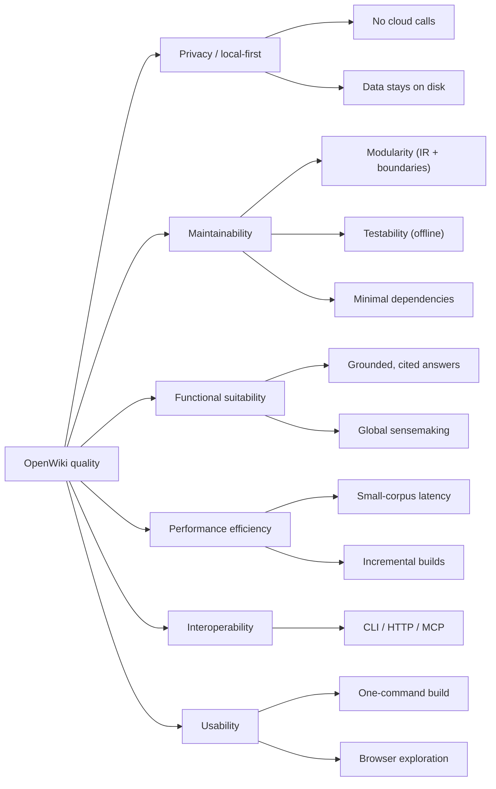

# 10. Quality Requirements

> arc42 §10 — The quality tree (refining §1.2 goals) and concrete, testable quality scenarios.
> **Status: draft.**

## 10.1 Quality Tree

## 10.2 Quality Scenarios

Scenarios are written as *stimulus → expected response* so they can be checked.

| ID | Quality | Scenario (stimulus → response) |
|---|---|---|
| QS-1 | Privacy | Run any command with no network → succeeds using only the local Ollama + local files; no external host is contacted. |
| QS-2 | Testability | `pytest` on a bare checkout with no Ollama and no Kuzu → passes (Ollama faked; Kuzu tests skipped cleanly). |
| QS-3 | Modularity | Add a new source format → implement one parser + one `sources.parse_source` case; no downstream module changes. |
| QS-4 | Modularity | Swap the embedding backend → implement the `Embedder` protocol; `search`/`agent`/`eval` unchanged. |
| QS-5 | Measurability | Ask "does the graph help?" → run `owiki eval [--answers/--global] --judge` → get reproducible metrics + a documented finding. |
| QS-6 | Correctness | Ask a question whose answer isn't in the corpus → the agent says so and does not invent (grounding enforced). |
| QS-7 | Performance | Rebuild after editing one source → only stale stages run (fingerprint chain), not the whole pipeline. |
| QS-8 | Robustness | Open a graph built before the community/reinforcement layer → store/UI still work (best-effort/empty). |
| QS-9 | Interop | A coding agent lists tools over MCP → sees only the tools its artifacts support (advertised by availability). |
| QS-10 | Usability | `openwiki init … && openwiki build && openwiki serve` → a browsable, searchable wiki with no extra config. |

## 10.3 Current evidence

- QS-2 holds: the suite (**253 tests**) runs offline.
- QS-5 holds: three findings recorded (retrieval, answer quality, global) in `docs/RAG-vs-GraphRAG.md`.
- QS-1/QS-6/QS-8 are architectural (enforced by design + tests).

---
TODO (completion steps): attach a concrete performance budget (indexing throughput, `ask`
latency on the reference corpus) once measured; add availability/observability scenarios
(currently minimal — logs to stderr only); prioritize scenarios (must/should).
