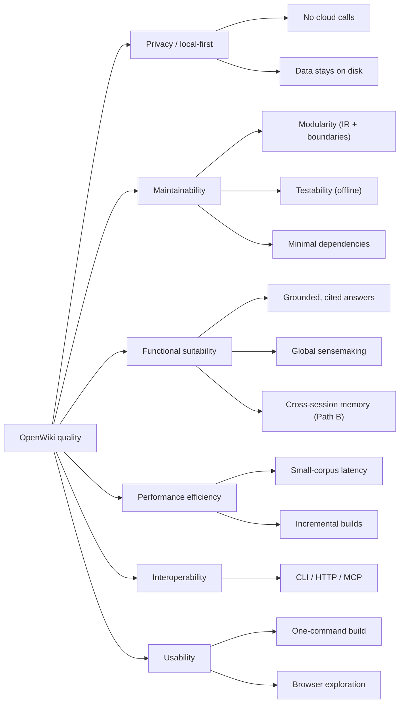

# 10. Quality Requirements

> arc42 §10 — The quality tree (refining §1.2 goals) and concrete, testable quality scenarios.
> **Status: complete.**

## 10.1 Quality Tree

## 10.2 Quality Scenarios

Scenarios are written as *stimulus → expected response* so they can be checked.

| ID | Quality | Prio | Scenario (stimulus → response) |
|---|---|---|---|
| QS-1 | Privacy | must | Run any command with no network → succeeds using only the local Ollama + local files; no external host is contacted. |
| QS-2 | Testability | must | `pytest` on a bare checkout with no Ollama and no Kuzu → passes (Ollama faked; Kuzu tests skipped cleanly). |
| QS-3 | Modularity | must | Add a new source format → implement one parser + one `sources.parse_source` case; no downstream module changes. |
| QS-4 | Modularity | should | Swap the embedding backend → implement the `Embedder` protocol; `search`/`agent`/`eval` unchanged. |
| QS-5 | Measurability | must | Ask "does the graph help?" → run `owiki eval [--answers/--global] --judge` → get reproducible metrics + a documented finding. |
| QS-6 | Correctness | must | Ask a question whose answer isn't in the corpus → the agent says so and does not invent (grounding enforced). |
| QS-7 | Performance | should | Rebuild after editing one source → only stale stages run (fingerprint chain), not the whole pipeline. |
| QS-8 | Robustness | should | Open a graph built before the community/reinforcement layer → store/UI still work (best-effort/empty). |
| QS-9 | Interop | should | A coding agent lists tools over MCP → sees only the tools its artifacts support (advertised by availability). |
| QS-10 | Usability | should | `openwiki init … && openwiki build && openwiki serve` → a browsable, searchable wiki with no extra config. |
| QS-11 | Observability | should | A run fails (e.g. Ollama down) → the operator gets a clear, actionable message. *(Partial: clear stderr messages, but no structured logs/metrics — §11 D7.)* |
| QS-12 | Cross-session memory | should | In Second Brain mode, establish a fact in one session and change it in a later one → `recall` returns the **current** fact, not the stale one (contradiction handling, ADR-18); the memory survives a `graph-build` (ADR-16); `eval --cross-session` measures assembled memory beating cold-start + raw-log. |

## 10.3 Current evidence & gaps

- **Met:** QS-2 (the suite — **284 tests** — runs offline); QS-5 (three findings in
  `docs/RAG-vs-GraphRAG.md`); QS-1 / QS-3 / QS-4 / QS-6 / QS-8 / QS-9 are architectural
  (enforced by boundaries + tests); QS-7 by the fingerprint chain (ADR-11); QS-12 by the memory
  tests + the cross-session eval (Path B, §8.15).
- **Not formally measured (performance):** there is no latency/throughput budget yet. Known
  scale on the reference corpus (informatik): 16 PDFs → 76 wiki pages → 2 703 chunks → a graph
  of 76 pages / 760 `SIMILAR_TO` / 32 `REFERENCES`; retrieval is brute-force O(n) (fine here,
  won't scale — §11 R3/D3). A concrete budget (index throughput, `ask` p50/p95) is an open
  item, gated mostly on the local model + hardware.
- **Partial (observability):** QS-11 — clear error messages but stderr-only logging, no
  metrics (§11 D7).

---
*Chapter complete. Priorities are indicative (this is a single-user learning project, not an
SLA-bound service). Cross-refs: goals → §1.2; realizing decisions → §9; the perf/observability
gaps → §11.*
