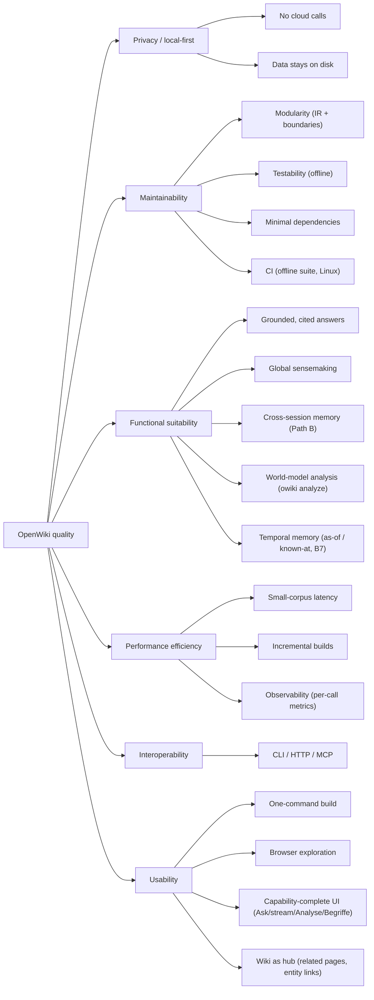

# 10. Quality Requirements

> arc42 §10 — The quality tree (refining §1.2 goals) and concrete, testable quality scenarios.
> **Status: complete.**

## 10.1 Quality Tree

## 10.2 Quality Scenarios

Scenarios are written as *stimulus → expected response* so they can be checked.

| ID | Quality | Prio | Scenario (stimulus → response) |
|---|---|---|---|
| QS-1 | Privacy | must | Run any command with no network → succeeds using only the local Ollama + local files; no external host is contacted. |
| QS-2 | Testability | must | `pytest` on a bare checkout with no Ollama and no Kuzu → passes (Ollama faked; Kuzu tests skipped cleanly). Runs in **CI** on every push (Python 3.11–3.13, ADR-24). |
| QS-3 | Modularity | must | Add a new source format → implement one parser + one `sources.parse_source` case; no downstream module changes. |
| QS-4 | Modularity | should | Swap the embedding backend → implement the `Embedder` protocol; `search`/`agent`/`eval` unchanged. |
| QS-5 | Measurability | must | Ask "does the graph help?" → run `owiki eval [--answers/--global] --judge` → get reproducible metrics + a documented finding. |
| QS-6 | Correctness | must | Ask a question whose answer isn't in the corpus → the agent says so and does not invent (grounding enforced). |
| QS-7 | Performance | should | Rebuild after editing one source → only stale stages run (fingerprint chain), not the whole pipeline. |
| QS-8 | Robustness | should | Open a graph built before the community/reinforcement layer → store/UI still work (best-effort/empty). |
| QS-9 | Interop | should | A coding agent lists tools over MCP → sees only the tools its artifacts support (advertised by availability). |
| QS-10 | Usability | should | `openwiki init … && openwiki build && openwiki serve` → a browsable, searchable wiki with no extra config. |
| QS-11 | Observability | should | A run fails (e.g. Ollama down) → a clear, actionable message; **and** every LLM/embedding call's latency + token counts are captured (`metrics.py`, ADR-20) and surfaced in the CLI `⏱` footer, the **System** tab (`/api/metrics`), per-turn chat stats, and per-build-stage on Projekt. |
| QS-12 | Cross-session memory | should | In Second Brain mode, establish a fact in one session and change it in a later one → `recall` returns the **current** fact, not the stale one (contradiction handling, ADR-18); the memory survives a `graph-build` (ADR-16); `eval --cross-session` measures assembled memory beating cold-start + raw-log. |
| QS-13 | Measurability (structure) | should | Ask "how well-organized is this KB / how much does the graph add?" → `owiki analyze` (coupling / gaps / compare / memory, ADR-25) returns reproducible structural metrics (e.g. the *graph-reach* headline) — offline, read-only; two KBs compare via `--compare`. |
| QS-14 | Usability (UI) | should | Open `serve` in a browser → every major capability is reachable without the CLI: **Ask** with GraphRAG/hybrid/re-rank/global controls (streaming), the **Analyse** tab (coupling/gaps/memory + map), the **Begriffe** entity browser, and source/book provenance filtering — no build step, no JS dependencies (ADR-26); a page's graph connectivity (references, backlinks, similar pages, shared entities) is one click away under it, and entity mentions link to their Begriffe entry (ADR-28). |
| QS-15 | Correctness (temporal memory) | should | Remember a newer session, then backfill an older one → `recall` still returns the **present** value; `recall --as-of D` returns the value valid at D; `--known-at K` returns what was believed at K (before a later correction); a correction retracts rather than ends the old fact; two coexisting values ("uses Kuzu" + "uses Ollama") both stay current (ADR-27). `examples/eval_temporal.jsonl` measures it. |

## 10.3 Current evidence & gaps

- **Met:** QS-2 (the suite — **446 tests** — runs offline, and in **CI** on every push across Python
  3.11–3.13 + a Docker build, ADR-24); QS-5 (four findings in `docs/RAG-vs-GraphRAG.md`, incl. hybrid
  winning on a code corpus); QS-11 by the metrics collector (ADR-20 — per-call latency/tokens in the CLI,
  System tab, and per-build-stage); QS-13 by the world-model analysis toolkit (ADR-25, §8.19 — `owiki
  analyze` coupling/gaps/compare/memory, offline + read-only); QS-14 by the capability-complete web UI
  (ADR-26, §8.20 — Direction J, U1–U11 incl. SSE streaming) + the reader overlays (ADR-28); QS-15 by B7
  (ADR-27) — the temporal eval took assembled-memory task success from **7/13 (v0.80.0, two runs) to 13/13**
  (13 hand-written scenarios — a direction check, not a benchmark); QS-1 / QS-3 / QS-4 / QS-6 / QS-8 / QS-9 are
  architectural (enforced by boundaries + tests); QS-7 by the fingerprint chain (ADR-11); QS-12 by the
  memory tests + the cross-session eval (Path B, §8.15).
- **Not formally measured (performance):** there is no latency/throughput *budget* yet — though the
  observability layer (ADR-20) now surfaces per-run p50/p95 latency + tokens, so measurement is a query
  away. Known scale on the reference corpus (informatik), built with the full graph (`--relations
  --resolve-entities`): 16 PDFs → 76 wiki pages → 2 703 chunks → a graph of 76 pages / 760 `SIMILAR_TO` /
  32 `REFERENCES` / 1 423 canonical entities (from 1 520 raw) / 1 953 `MENTIONS` / 1 364 typed `RELATED_TO`
  / 6 communities; retrieval is brute-force O(n) (fine here, won't scale — §11 R3/D3). A concrete budget (index throughput, `ask` p50/p95) is an open item, gated mostly on the
  local model + hardware.

---
*Chapter complete. Priorities are indicative (this is a single-user learning project, not an
SLA-bound service). Cross-refs: goals → §1.2; realizing decisions → §9; the perf/observability
gaps → §11.*
