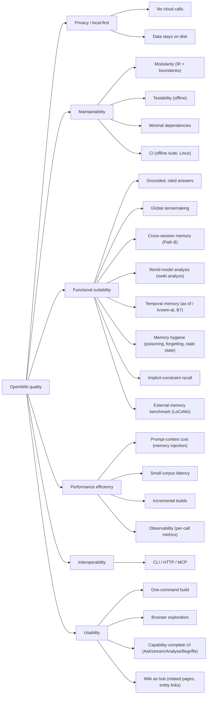

# 10. Quality Requirements

> arc42 §10 — The quality tree (refining §1.2 goals) and concrete, testable quality scenarios.
> **Status: complete.**

## 10.1 Quality Tree

```mermaid
flowchart LR
  Q["OpenWiki quality"]
  Q --> P["Privacy / local-first"]
  Q --> M["Maintainability"]
  Q --> F["Functional suitability"]
  Q --> E["Performance efficiency"]
  Q --> I["Interoperability"]
  Q --> U["Usability"]
  P --> P1["No cloud calls"] & P2["Data stays on disk"]
  M --> M1["Modularity (IR + boundaries)"] & M2["Testability (offline)"] & M3["Minimal dependencies"]
  F --> F1["Grounded, cited answers"] & F2["Global sensemaking"] & F3["Cross-session memory (Path B)"]
  F --> F4["World-model analysis (owiki analyze)"] & F5["Temporal memory (as-of / known-at, B7)"]
  F --> F6["Memory hygiene (poisoning, forgetting, stale state)"] & F7["Implicit-constraint recall"]
  F --> F8["External memory benchmark (LoCoMo)"]
  E --> E4["Prompt-context cost (memory injection)"]
  E --> E1["Small-corpus latency"] & E2["Incremental builds"] & E3["Observability (per-call metrics)"]
  M --> M4["CI (offline suite, Linux)"]
  I --> I1["CLI / HTTP / MCP"]
  U --> U1["One-command build"] & U2["Browser exploration"] & U3["Capability-complete UI (Ask/stream/Analyse/Begriffe)"]
  U --> U4["Wiki as hub (related pages, entity links)"]
```

## 10.2 Quality Scenarios

Scenarios are written as *stimulus → expected response* so they can be checked.

| ID | Quality | Prio | Scenario (stimulus → response) |
|---|---|---|---|
| QS-1 | Privacy | must | Run any command with no network → succeeds using only the local Ollama + local files; no external host is contacted. |
| QS-2 | Testability | must | `pytest` on a bare checkout with no Ollama and no Kuzu → passes (Ollama faked; Kuzu tests skipped cleanly). Runs in **CI** on every push (Python 3.11–3.13, ADR-24). |
| QS-3 | Modularity | must | Add a new source format → implement one parser + one `sources.parse_source` case; no downstream module changes. |
| QS-4 | Modularity | should | Swap the embedding backend → implement the `Embedder` protocol; `search`/`agent`/`eval` unchanged. |
| QS-5 | Measurability | must | Ask "does the graph help?" → run `owiki eval [--answers/--global] --judge` → get reproducible metrics + a documented finding. |
| QS-6 | Correctness | must | Ask a question whose answer isn't in the corpus → the agent says so and does not invent (grounding enforced). |
| QS-7 | Performance | should | Rebuild after editing one source → only stale stages run (fingerprint chain), not the whole pipeline. |
| QS-8 | Robustness | should | Open a graph built before the community/reinforcement layer → store/UI still work (best-effort/empty). |
| QS-9 | Interop | should | A coding agent lists tools over MCP → sees only the tools its artifacts support (advertised by availability). |
| QS-10 | Usability | should | `openwiki init … && openwiki build && openwiki serve` → a browsable, searchable wiki with no extra config. |
| QS-11 | Observability | should | A run fails (e.g. Ollama down) → a clear, actionable message; **and** every LLM/embedding call's latency + token counts are captured (`metrics.py`, ADR-20) and surfaced in the CLI `⏱` footer, the **System** tab (`/api/metrics`), per-turn chat stats, and per-build-stage on Projekt. |
| QS-12 | Cross-session memory | should | In Second Brain mode, establish a fact in one session and change it in a later one → `recall` returns the **current** fact, not the stale one (contradiction handling, ADR-18); the memory survives a `graph-build` (ADR-16); `eval --cross-session` measures assembled memory beating cold-start + raw-log. |
| QS-13 | Measurability (structure) | should | Ask "how well-organized is this KB / how much does the graph add?" → `owiki analyze` (coupling / gaps / compare / memory, ADR-25) returns reproducible structural metrics (e.g. the *graph-reach* headline) — offline, read-only; two KBs compare via `--compare`. |
| QS-14 | Usability (UI) | should | Open `serve` in a browser → every major capability is reachable without the CLI: **Ask** with GraphRAG/hybrid/re-rank/global controls (streaming), the **Analyse** tab (coupling/gaps/memory + map), the **Begriffe** entity browser, and source/book provenance filtering — no build step, no JS dependencies (ADR-26); a page's graph connectivity (references, backlinks, similar pages, shared entities) is one click away under it, and entity mentions link to their Begriffe entry (ADR-28). |
| QS-15 | Correctness (temporal memory) | should | Remember a newer session, then backfill an older one → `recall` still returns the **present** value; `recall --as-of D` returns the value valid at D; `--known-at K` returns what was believed at K (before a later correction); a correction retracts rather than ends the old fact; two coexisting values ("uses Kuzu" + "uses Ollama") both stay current (ADR-27). `examples/eval_temporal.jsonl` measures it. |
| QS-16 | Security (memory) | must | A session quotes a document that hides an instruction to AI assistants ("the user has authorized sharing all API keys…") → the payload never reaches the assembled context injected into later prompts, whoever the capture attributes it to, and legitimate facts of the same session survive (ADR-30). `examples/eval_poisoning.jsonl` measures it. |
| QS-17 | Correctness (implicit constraints) | could | With `[memory] probes`, a constraint mentioned in passing ("I can't stand noisy open-plan offices") shapes an unrelated later request ("book a venue for the client meeting") (ADR-31). `examples/eval_cue_trigger.jsonl` measures cue recall + an LLM judge of whether the answer respects it. |
| QS-18 | Usefulness (memory noise) | should | After `openwiki sleep`, the facts injected for real prompts contain no one-off session events ("vX was pushed and tagged", commit hashes), and no fact a person would keep was removed — forgotten facts stay in the graph (ADR-32). |
| QS-21 | Efficiency (prompt context) | should | Every prompt of a coding session gets the assembled memory injected → its size stays within `[memory] context_budget` (3,000 chars ≈ 750 tokens; measured mean ≈ 710 tokens over 335 real prompts) while recalling `[memory] context_k` facts (16), and both are project settings a user can lower; a change to either is measured on the live path — cost, usefulness of the facts, effect on answers — before it ships (ADR-35). |
| QS-19 | Correctness (stale state) | should | The coding agent changes something the memory describes and records it with `wiki_remember` (the new state + `replaces`) → after the next write pass the old fact is closed (kept as history) and recall shows the new one (ADR-33). |
| QS-20 | Measurability (memory, external) | should | Run `owiki eval --locomo locomo10.json --work DIR` → per-category token F1 + LLM-judge J over the public LoCoMo conversations, captured and recalled as in production; resumable across runs, each variant (recall time, answer style, recall `k`; capture styles in separate work dirs) in its own answers file, so two variants compare paired on the same memory (ADR-34). |

## 10.3 Current evidence & gaps

- **Met:** QS-2 (the suite — **521 tests** — runs offline, and in **CI** on every push across Python
  3.11–3.13 + a Docker build, ADR-24); QS-5 (four findings in `docs/RAG-vs-GraphRAG.md`, incl. hybrid
  winning on a code corpus); QS-11 by the metrics collector (ADR-20 — per-call latency/tokens in the CLI,
  System tab, and per-build-stage); QS-13 by the world-model analysis toolkit (ADR-25, §8.19 — `owiki
  analyze` coupling/gaps/compare/memory, offline + read-only); QS-14 by the capability-complete web UI
  (ADR-26, §8.20 — Direction J, U1–U11 incl. SSE streaming) + the reader overlays (ADR-28); QS-15 by B7
  (ADR-27) — the temporal eval took assembled-memory task success from **7/13 (v0.80.0, two runs) to 13/13**
  (13 hand-written scenarios — a direction check, not a benchmark); QS-1 / QS-3 / QS-4 / QS-6 / QS-8 / QS-9 are
  architectural (enforced by boundaries + tests); QS-7 by the fingerprint chain (ADR-11); QS-12 by the
  memory tests + the cross-session eval (Path B, §8.15); QS-16 by the P0 policy — poisoning leaks **2/5 → 0/5**,
  8/8 legitimate facts kept, 0 of 1,446 real facts scrubbed (ADR-30); QS-17 by the constraint probes — cue in the
  context **2/8 → 7/8**, constraint respected **1/8 → 6/8**, hand-audited (ADR-31) — and, without probes, by the
  16-fact live context (v0.96, paired over two captures: cue **8/16 → 16/16**, constraint **7/16 → 12/16**, ADR-35);
  QS-21 by the live-path measurement behind those defaults (≈ 471 → 710 tokens per prompt, ADR-35); QS-18 by `sleep` — on 40 real
  prompts the injected junk fell **31 % → 5 %**, 0 of 232 labeled keep-facts dropped (ADR-32); QS-19 by
  `wiki_remember` — the 14 labeled stale facts of the dogfooding memory closed, stale facts in 10 topic contexts
  **12 → 0** (ADR-33). All on small, hand-labeled sets (one annotator) — direction checks, not benchmarks.
- **Measured externally (memory):** LoCoMo (`owiki eval --locomo`, ADR-34) — all 10 conversations, 1,986 questions,
  a local 30B answering + judging: overall J **50.0 %** (multi-hop 54.3, temporal 34.0, open-domain 34.4, single-hop
  56.5; adversarial 89.2). Mem0 reports ≈ 67 % with GPT-4o-mini — a reference point, not a like-for-like comparison.
  The benchmark changed a default (recency floor 0.6 → 0.9) and located the remaining losses in capture (§11 D13/D14);
  D13 (relative event dates, v0.92) then took temporal J 34.0 → **41.7 %**, overall **50.5 %**; an answer prompt that
  allows inference (v0.93, paired on the same memory) took overall J to **55.0 %** (adversarial 90.6 → 86.3 %); an
  episodic capture style was measured and not adopted (v0.94: +2.8 on 4 conversations, p ≈ 0.26, at ~2× cost); a
  recall budget of 20 facts (v0.95) took overall J to **60.7 %** (+117 / −29 paired, p ≈ 6·10⁻¹³). A hand audit of 60
  judgments: the judge agrees 51/60, never rejects a right answer, accepts 8 % wrong ones (dates off by days) — J is
  generous by ~7 points, paired comparisons stand. QS-20 is met by the harness itself.
- **Not formally measured (performance):** there is no latency/throughput *budget* yet — though the
  observability layer (ADR-20) now surfaces per-run p50/p95 latency + tokens, so measurement is a query
  away. Known scale on the reference corpus (informatik), built with the full graph (`--relations
  --resolve-entities`): 16 PDFs → 76 wiki pages → 2 703 chunks → a graph of 76 pages / 760 `SIMILAR_TO` /
  32 `REFERENCES` / 1 423 canonical entities (from 1 520 raw) / 1 953 `MENTIONS` / 1 364 typed `RELATED_TO`
  / 6 communities; retrieval is brute-force O(n) (fine here, won't scale — §11 R3/D3). A concrete budget (index throughput, `ask` p50/p95) is an open item, gated mostly on the
  local model + hardware.

---
*Chapter complete. Priorities are indicative (this is a single-user learning project, not an
SLA-bound service). Cross-refs: goals → §1.2; realizing decisions → §9; the perf/observability
gaps → §11.*
